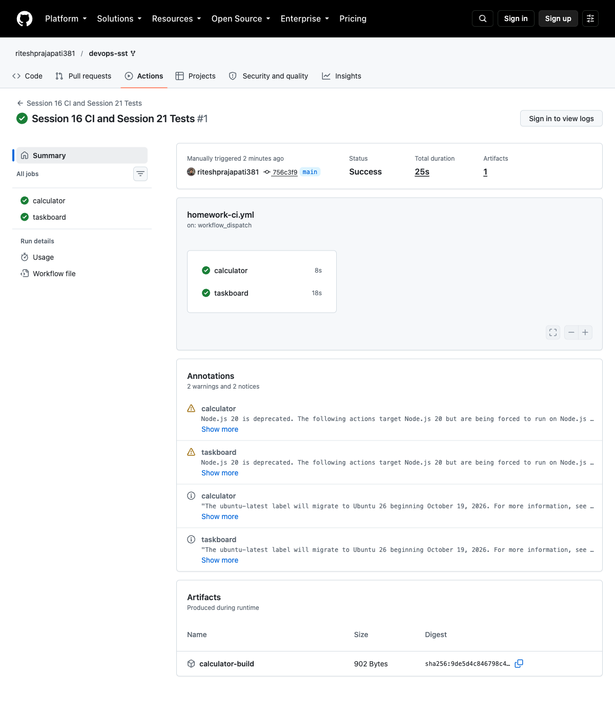

# CICD & GitHub Actions

The calculator workflow runs tests, builds the application and uploads a build artifact. It also runs the TaskBoard API tests.

| Term | Meaning |
|---|---|
| CI | Tests and builds code changes |
| CD | Deploys validated changes |
| Runner | Executes workflow jobs |
| Job and step | A group of tasks and an individual task |
| Secret | Sensitive runtime value |
| Artifact | Saved build output |

```bash
cd demo
python3 -m venv .venv
. .venv/bin/activate
pip install -r requirements.txt
python -m pytest -v
bash build.sh
```

Result: 5 calculator tests passed, the build artifact was created and the Docker image returned 5 for the addition example.

[Workflow](../.github/workflows/homework-ci.yml) · [Successful run](https://github.com/riteshprajapati381/devops-sst/actions/runs/37629188616)

## Screenshots



## Command output

- [github actions](output/logs/github-actions.log)
- [remote tests](output/logs/remote-tests.log)
