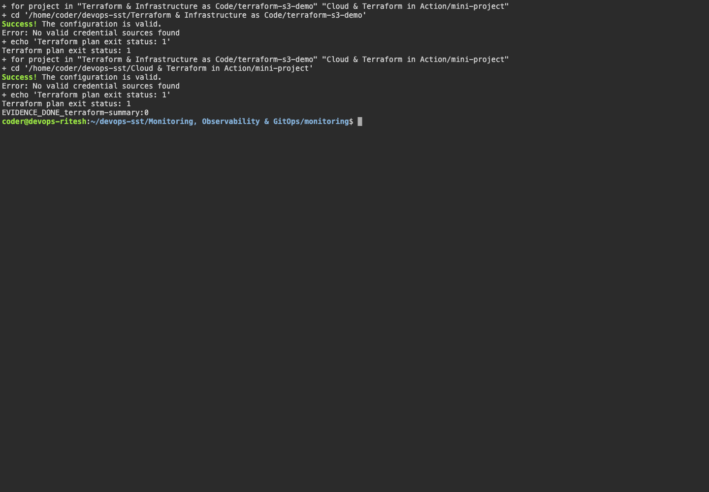

# Cloud & Terraform in Action

`mini-project/` defines a VPC, public subnet, Internet Gateway, route table, Security Group, EC2 nginx server and private S3 bucket. Resource references define dependencies; Terraform state tracks the managed resources.

```bash
cd mini-project
terraform fmt -recursive
terraform init
terraform validate
terraform plan
```

Result: formatting, initialization and validation passed. Plan failed because AWS credentials were unavailable. No AWS resources were created.

After configuring AWS credentials:

```bash
terraform apply
terraform show
terraform output
terraform destroy
```

Apply, resource verification and destroy remain pending.

## Screenshots



## Command output

- [terraform](output/logs/terraform.log)
