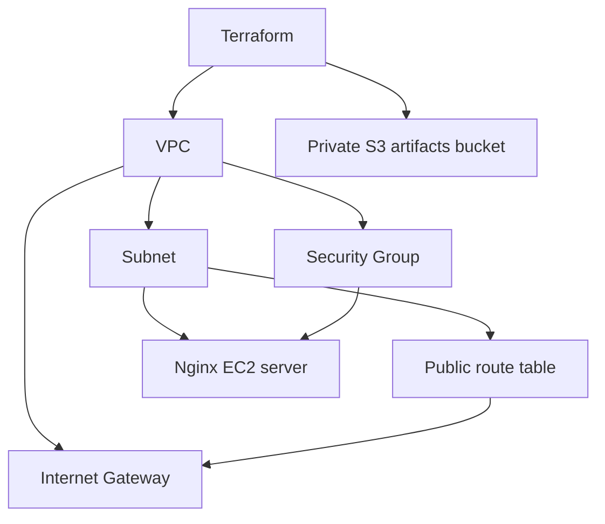

# Cloud & Terraform in Action

## Execution environment

Name: Ritesh Prajapati. Fresh evidence was collected on 7 October 2026 from Ubuntu host `devops-ritesh`, reached using `ssh dev.devops-ritesh.riteshprajapati.coder`. Terminal images are Playwright captures of a live browser terminal connected to that SSH host. Browser images show the actual remote services through SSH port forwarding.

## Infrastructure project

`mini-project/` is based on the teacher's session 19 infrastructure. It defines a VPC, public subnet, Internet Gateway, route table and association, a Security Group, an EC2 web server and a private S3 artifacts bucket. The references between resources express creation dependencies automatically. Inputs parameterize the region; outputs expose resource identifiers.



Terraform state maps configuration addresses to real resources. Plan previews a change, apply reconciles it, and destroy removes the managed infrastructure. State can contain sensitive values and must be protected.

## Run

```bash
cd mini-project
terraform init
terraform fmt -recursive
terraform validate
terraform plan
terraform apply
terraform show
terraform output
terraform destroy
```

Live AWS creation/deletion requires the intended course account. Screenshots of actual cloud resources cannot be supplied without that access; this is recorded as pending rather than fabricating a deployment.

## Verified configuration and AWS blocker

`terraform fmt`, `terraform init` and `terraform validate` passed on the SSH host. `terraform plan` failed with **No valid credential sources found**. The exact output is captured below. No AWS resources were created; apply, show/output of live resources and destroy remain pending credentials. The invalid `type` attributes in the teacher's S3 outputs were removed because Terraform outputs infer their type from their value.

## Captured evidence


### Actual command output

- [terraform](output/logs/terraform.log)
