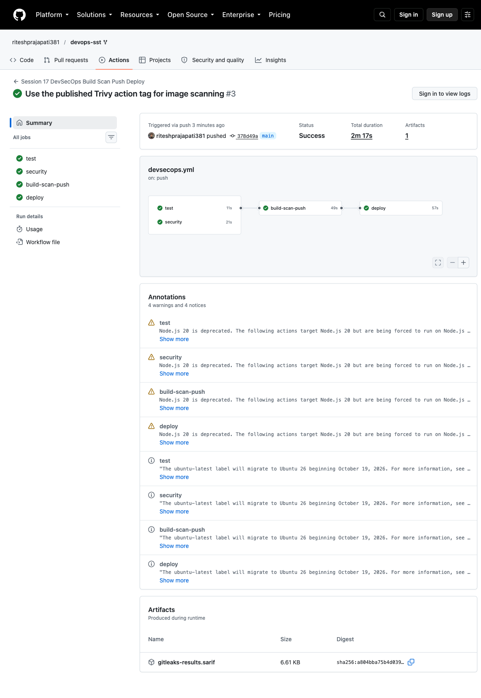
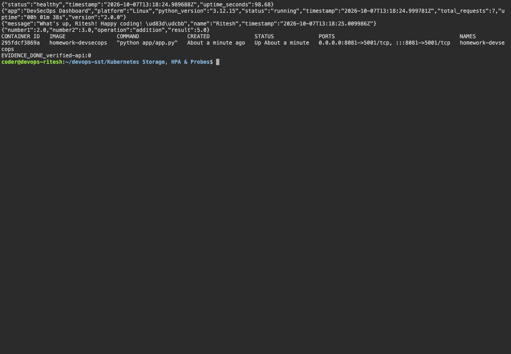

# Complete CICD & DevSecOps

## Execution environment

Name: Ritesh Prajapati. Fresh evidence was collected on 7 October 2026 from Ubuntu host `devops-ritesh`, reached using `ssh dev.devops-ritesh.riteshprajapati.coder`. Terminal images are Playwright captures of a live browser terminal connected to that SSH host. Browser images show the actual remote services through SSH port forwarding.

## Pipeline and application

The teacher's Flask demo implements health, status, greetings and calculator endpoints. The active workflow is [`../.github/workflows/devsecops.yml`](../.github/workflows/devsecops.yml).

```text
Tests + Bandit SAST + pip-audit SCA + Gitleaks secret scan
  -> Docker build
  -> Trivy HIGH/CRITICAL security gate
  -> Push SHA-tagged image to GHCR
  -> Pull the same image into a disposable kind cluster
  -> Apply Deployment/Service and verify HTTP endpoints
```

The GitHub-hosted runner creates a real ephemeral Kubernetes cluster for the CD demonstration. This avoids pretending it can directly access a private Coder machine. The image is tagged with the full Git commit SHA. GHCR authentication uses GITHUB_TOKEN; no registry password is committed. Trivy gates fixable HIGH/CRITICAL findings (`ignore-unfixed: true`).

The container runs as a non-root user and Flask debug mode is disabled. Security exclusions and the precise baseline for inherited classroom-only credentials are explained in `demo/SECURITY.md`.

## Run locally

```bash
cd 'Complete CICD & DevSecOps/demo'
python3 -m venv .venv
. .venv/bin/activate
pip install -r requirements-dev.txt
pytest -v --cov=app
docker build -t homework-devsecops .
docker run -d --name homework-devsecops -p 8081:5001 homework-devsecops
curl http://localhost:8081/health
```

## Verified CI/CD result

[Successful full DevSecOps run](https://github.com/riteshprajapati381/devops-sst/actions/runs/37621662696): tests, all security checks, image scan/push and Kubernetes deployment passed. The image is `ghcr.io/riteshprajapati381/devops-homework:378d49a4ba10c526f9c0d03b298d7b40aaf564db` with the actual full commit SHA in the workflow log; use the full SHA from that log when pulling.

The recorded Trivy gate passed for the scanned image. This means no findings blocked the configured fixable HIGH/CRITICAL gate at the run time; it is not a guarantee that the application has no vulnerabilities or that future scans will have the same result.

## Fresh SSH result

Eight Flask tests passed on the SSH host, with 69% coverage reported by the existing test suite. The application image ran as the non-root user and returned healthy status, a greeting and the correct addition result of 5. The first manual addition request used incorrect field names and returned 400; using the documented `number1` and `number2` fields succeeded. `verified-api.png` shows the successful smoke checks. The dashboard browser screenshot demonstrates the running app; it is not used as evidence of real GitHub Actions execution.

## Captured evidence






### Actual command output

- [github actions](output/logs/github-actions.log)
- [remote tests](output/logs/remote-tests.log)
