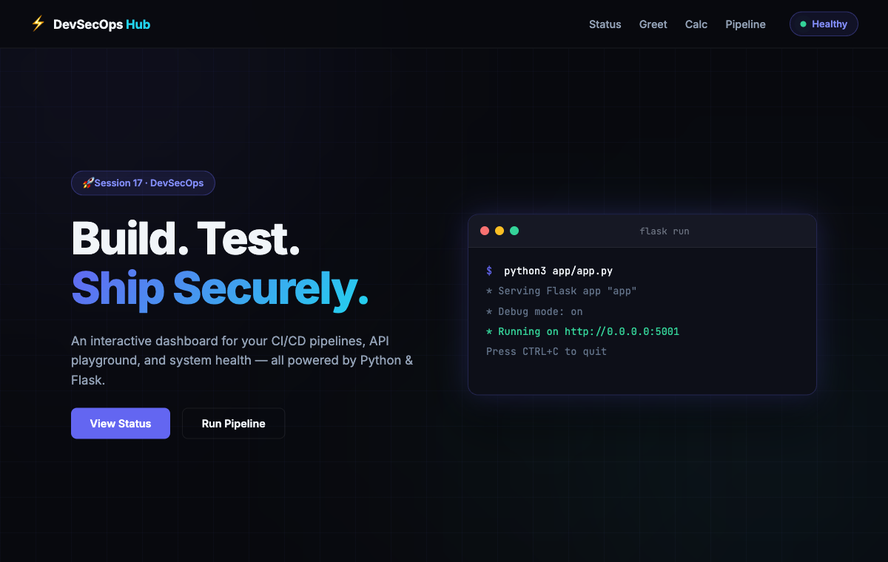
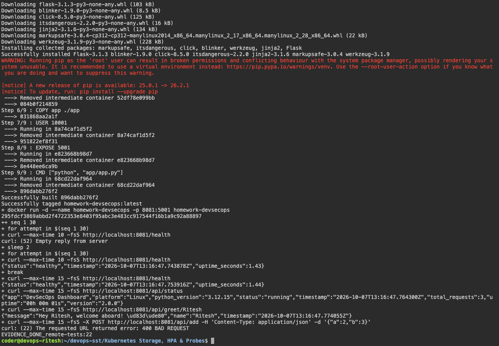

# Complete CICD & DevSecOps

The Flask application has health, status, greeting and calculator endpoints.

## Pipeline

```text
Tests → Bandit → pip-audit → Gitleaks → Docker build
      → Trivy → GHCR push → Kubernetes deployment → HTTP checks
```

The image uses the commit SHA as its tag and runs as a non-root user with debug mode disabled. Trivy blocks fixable HIGH/CRITICAL findings. Scan settings are in [SECURITY.md](demo/SECURITY.md).

## Commands

```bash
cd demo
python3 -m venv .venv
. .venv/bin/activate
pip install -r requirements-dev.txt
pytest -v --cov=app
docker build -t homework-devsecops .
docker run -d --name homework-devsecops -p 8081:5001 homework-devsecops
curl http://localhost:8081/health
curl -H 'Content-Type: application/json' -d '{"number1":2,"number2":3}' http://localhost:8081/api/add
```

Result: 8 tests passed with 69% coverage. Health checks passed and addition returned 5. The pipeline passed all checks, pushed the image to GHCR and deployed it into a kind cluster.

[Workflow](../.github/workflows/devsecops.yml) · [Successful run](https://github.com/riteshprajapati381/devops-sst/actions/runs/37629188267)

## Screenshots







## Command output

- [github actions](output/logs/github-actions.log)
- [remote tests](output/logs/remote-tests.log)
