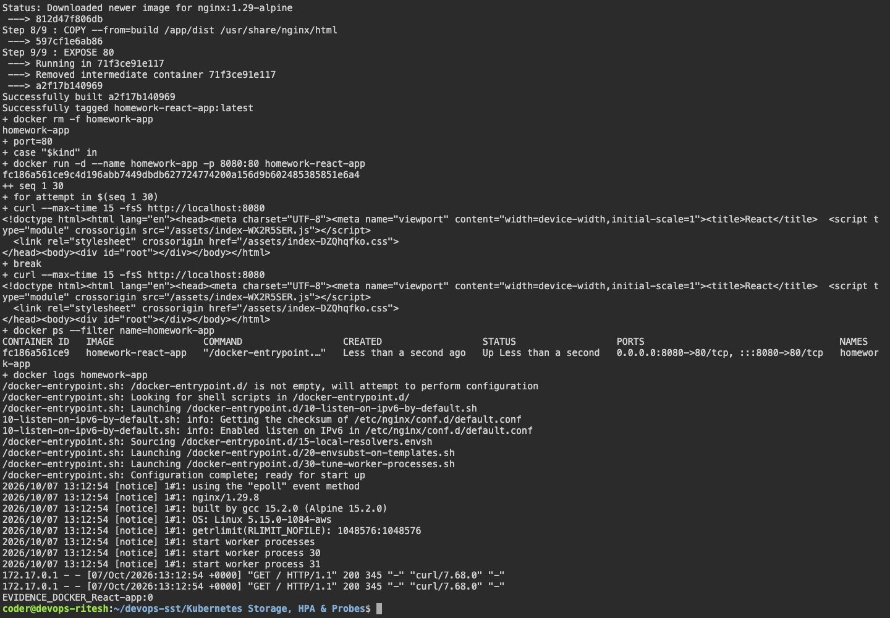
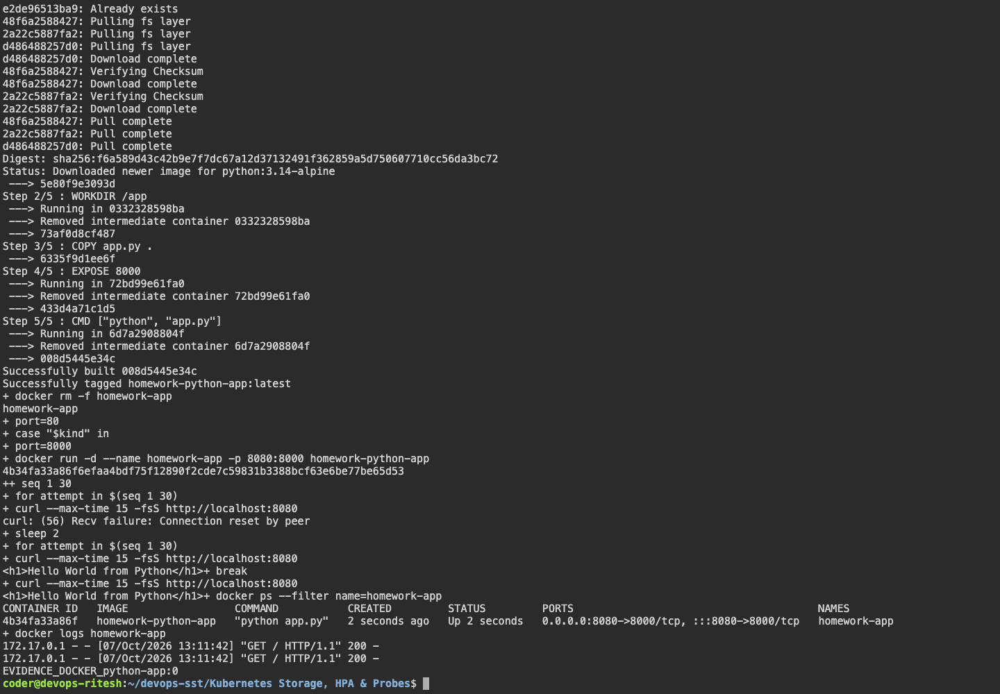

# Docker Fundamentals

## Node.js

```bash
docker build -t hello-node ./nodejs-app
docker run --rm -p 3000:3000 hello-node
```

## Python

```bash
docker build -t hello-python ./python-app
docker run --rm -p 8000:8000 hello-python
```

## Java

```bash
docker build -t hello-java ./java-app
docker run --rm -p 8080:8080 hello-java
```

## Apache

```bash
docker build -t hello-apache ./Apache-app
docker run --rm -p 8081:80 hello-apache
```

## React

```bash
docker build -t hello-react ./React-app
docker run --rm -p 8082:80 hello-react
```

## Nginx

```bash
docker build -t hello-nginx ./nginx-app
docker run --rm -p 8083:80 hello-nginx
```

All applications display Hello World on the browser.

## Captured evidence







### Actual command output

- [Apache app](output/logs/Apache-app.log)
- [React app](output/logs/React-app.log)
- [java app](output/logs/java-app.log)
- [nginx app](output/logs/nginx-app.log)
- [nodejs app](output/logs/nodejs-app.log)
- [python app](output/logs/python-app.log)
