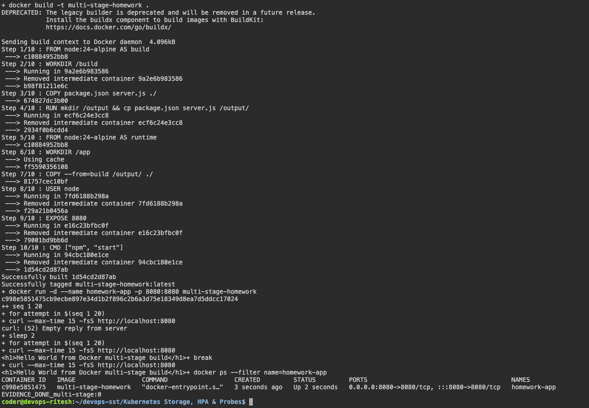

# Docker Images

Name: Ritesh Prajapati

Enrollment number: pending student input

## Multi-stage build

```bash
cd "Docker Images/multi-stage-app"
docker build -t multi-stage-homework .
docker run -d --name multi-stage-homework -p 8080:8080 multi-stage-homework
curl http://localhost:8080
```

Output:

```text
Hello World from Docker multi-stage build
```

```bash
docker ps
docker stop multi-stage-homework
docker rm multi-stage-homework
```

Node.js, Python and Java applications are available in the Docker Fundamentals folder.

## Captured evidence




### Actual command output

- [multi stage](output/logs/multi-stage.log)
