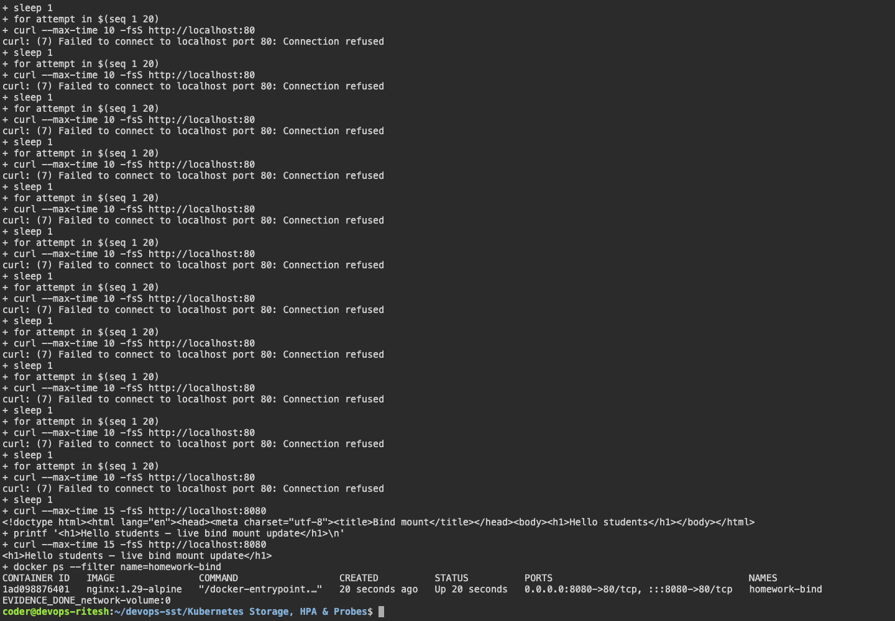

# Docker Networking

## Three networks

Frontend uses `frontend-net`; backend uses `frontend-net` and `backend-net`; MySQL uses `backend-net` and `isolated-net`. Frontend can reach backend, and backend can reach MySQL. Frontend cannot reach MySQL directly.

```bash
docker compose up -d
docker network ls
docker inspect homework-backend
docker exec homework-frontend ping -c 2 backend
docker exec homework-backend ping -c 2 database
docker compose down
```

## Host network

```bash
docker run -d --name homework-apache --network host httpd:2.4-alpine
curl http://localhost:80
docker rm -f homework-apache
```

Result: Apache served a page through the host network.

## Bind mount

```bash
docker run -d --name homework-bind -p 8080:80 \
  --mount type=bind,source="$(pwd)/bind-mount",target=/usr/share/nginx/html \
  nginx:1.29-alpine
curl http://localhost:8080
```

Result: editing `index.html` changed the page without restarting the container.

## Overlay network

Overlay networks connect containers across Docker hosts using VXLAN. Swarm manages nodes and service discovery. Required ports are TCP 2377, TCP/UDP 7946 and UDP 4789.

Example commands for a Swarm manager:

```bash
docker swarm init
docker network create --driver overlay --attachable app-overlay
```

The multi-host overlay portion is research; the container exercises used bridge and host networks.

## Screenshots




## Command output

- [network volume first attempt](output/logs/network-volume-first-attempt.log)
- [network volume](output/logs/network-volume.log)
