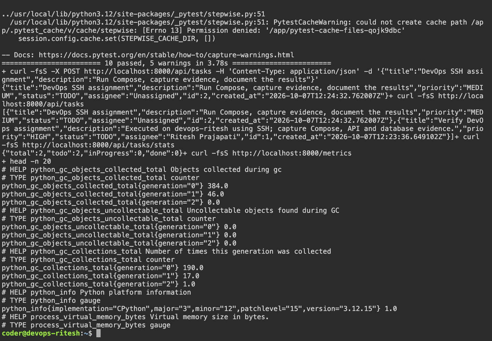
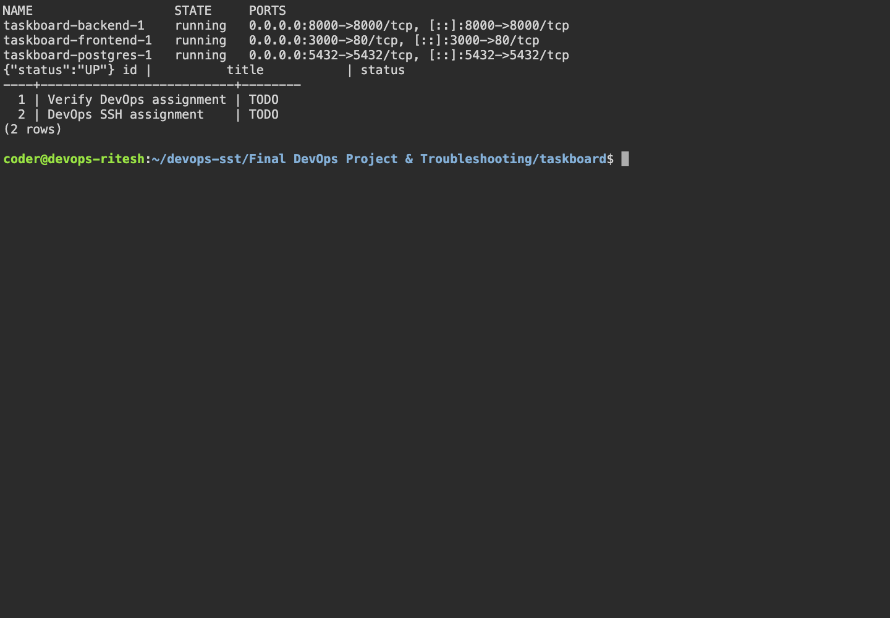
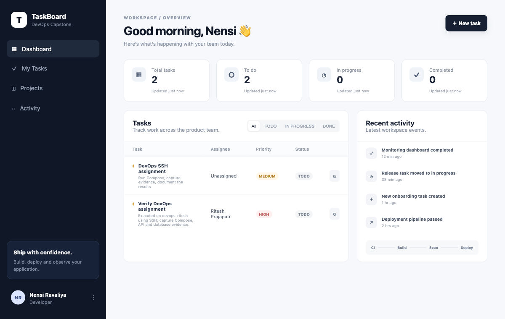

# Final DevOps Project & Troubleshooting

Ran the teacher's TaskBoard project for session 21 homework.

```text
Browser → React/Nginx → FastAPI → PostgreSQL
```

## Commands

```bash
cd taskboard
docker compose up -d --build
docker compose ps
curl http://localhost:8000/health
curl http://localhost:8000/ready
curl http://localhost:8000/api/tasks
docker compose run --rm --no-deps \
  -v "$(pwd)/backend/tests:/app/tests:ro" \
  -v "$(pwd)/backend/pytest.ini:/app/pytest.ini:ro" backend pytest -v
docker compose exec -T postgres psql -U taskboard -d taskboard -c 'SELECT id,title,status FROM tasks;'
```

Frontend: port 3000. API documentation: port 8000 at `/docs`.

Result: 10 API tests passed. A task created in the browser was verified in PostgreSQL. Task creation was fixed by saving the form reference before the asynchronous API request.

The separate original capstone is still pending.

## Screenshots







## Command output

- [compose verified](output/logs/compose-verified.log)
- [compose](output/logs/compose.log)
