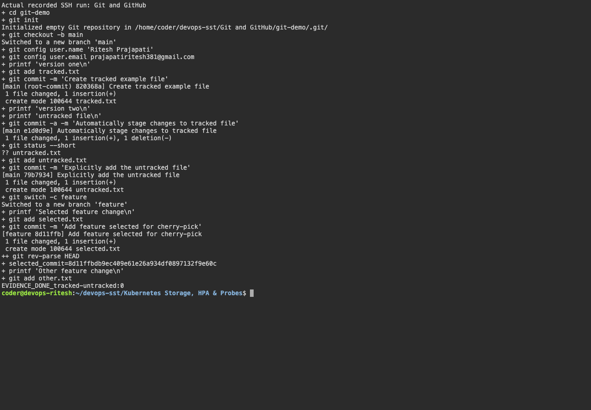

# Git and GitHub

## commit -m and commit -a -m

`git commit -m` commits staged changes. `git commit -a -m` also stages changes to tracked files, but leaves new files untracked.

```bash
git init
git checkout -b main
echo 'version 1' > tracked.txt
git add tracked.txt
git commit -m 'Add tracked file'
echo 'version 2' > tracked.txt
touch untracked.txt
git commit -a -m 'Update tracked file'
git status
git add untracked.txt
git commit -m 'Add new file'
```

## Cherry-pick

Cherry-pick applies a selected commit from another branch.

```bash
git checkout -b feature
echo 'selected change' > selected.txt
git add selected.txt
git commit -m 'Add selected change'
echo 'other change' > other.txt
git add other.txt
git commit -m 'Add other change'
git log --oneline
git checkout main
git cherry-pick <selected-commit-hash>
git log --oneline
cat selected.txt
test ! -f other.txt
```

Result: only the selected feature change was added to main.

## Screenshots




## Command output

- [session02 05](output/logs/session02-05.log)
