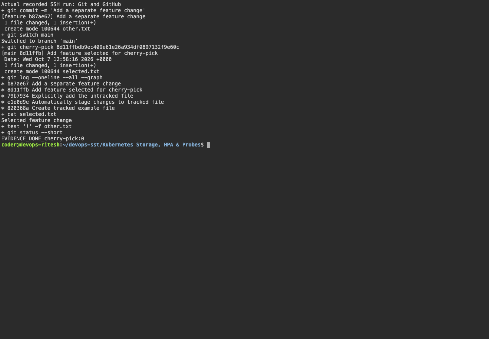

# Git and GitHub

The following examples are retained from the earlier homework. Fresh October 7 output is linked below.

in git commit -a -m "" the if there is some files which are already tracked and have some changes or deleted then those files are stagged automativally using -a while without it we need to add it using **git add filename**
```bash
coder@ritesh-aws:~/devops-assignment$ ls -a
.  ..  dir1  shell_script.sh
coder@ritesh-aws:~/devops-assignment$ git init
Initialized empty Git repository in /home/coder/devops-assignment/.git/
coder@ritesh-aws:~/devops-assignment$ echo "hello v1" >> file.txt
coder@ritesh-aws:~/devops-assignment$ git add
Nothing specified, nothing added.
Maybe you wanted to say 'git add .'?
coder@ritesh-aws:~/devops-assignment$ git add .
coder@ritesh-aws:~/devops-assignment$ git commit -m "v1"
[master (root-commit) 1b53c20] v1
 3 files changed, 124 insertions(+)
 create mode 100644 dir1/f1
 create mode 100644 file.txt
 create mode 100755 shell_script.sh
coder@ritesh-aws:~/devops-assignment$ git status
On branch master
nothing to commit, working tree clean
coder@ritesh-aws:~/devops-assignment$ echo "version2" > file.txt
coder@ritesh-aws:~/devops-assignment$ git status
On branch master
Changes not staged for commit:
  (use "git add <file>..." to update what will be committed)
  (use "git restore <file>..." to discard changes in working directory)
        modified:   file.txt

no changes added to commit (use "git add" and/or "git commit -a")
coder@ritesh-aws:~/devops-assignment$ touch file2.txt
coder@ritesh-aws:~/devops-assignment$ git status
On branch master
Changes not staged for commit:
  (use "git add <file>..." to update what will be committed)
  (use "git restore <file>..." to discard changes in working directory)
        modified:   file.txt

Untracked files:
  (use "git add <file>..." to include in what will be committed)
        file2.txt

no changes added to commit (use "git add" and/or "git commit -a")
coder@ritesh-aws:~/devops-assignment$ git commit -a -m "v2"
[master 26d1a4a] v2
 1 file changed, 1 insertion(+), 1 deletion(-)
coder@ritesh-aws:~/devops-assignment$ git status
On branch master
Untracked files:
  (use "git add <file>..." to include in what will be committed)
        file2.txt

nothing added to commit but untracked files present (use "git add" to track)
coder@ritesh-aws:~/devops-assignment$ git add .
coder@ritesh-aws:~/devops-assignment$ git commit -m "file2 also added"
[master b57f2df] file2 also added
 1 file changed, 0 insertions(+), 0 deletions(-)
 create mode 100644 file2.txt
coder@ritesh-aws:~/devops-assignment$ git status
On branch master
nothing to commit, working tree clean
```

## Task 2: Git cherry-pick

git cherry-pick copies one selected commit from another branch.

```bash
$ git log --oneline --decorate -6
69256f0 (HEAD -> feature) feature: add C
f1b72e5 feature: add selected change
71d1087 feature: add A
1a7830a (main) main: second update
b86f3df main: first update
dfbd1cf main: add base file
```

```bash
$ git switch main
Switched to branch 'main'
$ git cherry-pick f1b72e5
[main 030b0bc] feature: add selected change
 1 file changed, 1 insertion(+)
 create mode 100644 selected.txt

$ git log --oneline --decorate -5
030b0bc (HEAD -> main) feature: add selected change
1a7830a main: second update
b86f3df main: first update
dfbd1cf main: add base file

$ cat selected.txt
selected feature
```

The selected commit is now available in main branch.

## Fresh SSH verification

The new run created three main-branch commits and two feature commits. `git commit -a` committed the modified tracked file while leaving `untracked.txt` untracked; an explicit `git add` then included it. Cherry-picking the selected feature commit brought `selected.txt` to main, and `test ! -f other.txt` verified that the other feature change was absent.

Run [session02-05.sh](../scripts/session02-05.sh); the Ubuntu Git version uses `git init` followed by `git checkout -b main` because it predates `git init -b`.

## Captured evidence




### Actual command output

- [session02 05](output/logs/session02-05.log)
