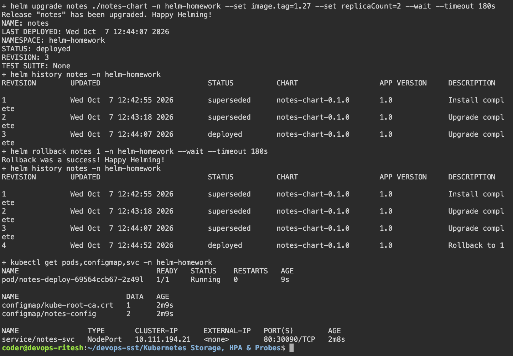

# Helm

## Execution environment

Name: Ritesh Prajapati. Fresh evidence was collected on 7 October 2026 from Ubuntu host `devops-ritesh`, reached using `ssh dev.devops-ritesh.riteshprajapati.coder`. Terminal images are Playwright captures of a live browser terminal connected to that SSH host. Browser images show the actual remote services through SSH port forwarding.

## Tasks and implementation

`notes-chart/` packages the teacher's Notes application with Deployment, NodePort Service and ConfigMap templates. `values.yaml` sets development defaults; `values-prod.yaml` changes the image, environment and replica count. Helm tracks each install/upgrade as a release revision and rollback restores a previous revision.

The workflow installs revision 1, upgrades to production values, upgrades again, and rolls back to revision 1. Rollback creates a new revision; it does not erase the earlier history. A chart is the package; a release is an installed instance of that chart.

## Run

```bash
bash ~/devops-sst/scripts/session15.sh
helm list -n helm-homework
helm history notes -n helm-homework
helm get values notes -n helm-homework
helm get manifest notes -n helm-homework
helm status notes -n helm-homework
# Cleanup after capturing the evidence:
helm uninstall notes -n helm-homework
```

## Captured evidence



### Actual command output

- [helm](output/logs/helm.log)
