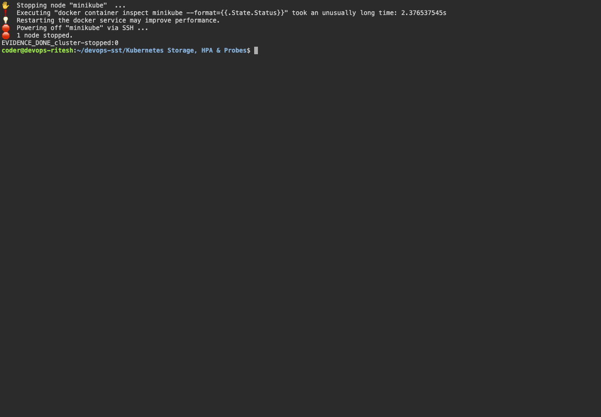

# Kubernetes Fundamentals

## Task

I created a local Kubernetes cluster using `kind` and ran a basic pod that prints `Hello Kubernetes`.

## Commands I ran

```bash
kind create cluster --name devops-assignment --wait 180s
kubectl cluster-info --context kind-devops-assignment
kubectl get nodes -o wide
kubectl apply -f hello.yml
kubectl wait --for=jsonpath='{.status.phase}'=Succeeded pod/hello-pod --timeout=60s
kubectl get pod hello-pod -o wide
kubectl logs hello-pod
```

## Output

```text
Kubernetes control plane is running at https://127.0.0.1:62555
CoreDNS is running at https://127.0.0.1:62555/api/v1/namespaces/kube-system/services/kube-dns:dns/proxy

NAME                              STATUS   ROLES           AGE     VERSION   INTERNAL-IP   EXTERNAL-IP   OS-IMAGE                       KERNEL-VERSION             CONTAINER-RUNTIME
devops-assignment-control-plane   Ready    control-plane   2m23s   v1.37.0   172.18.0.2    <none>        Debian GNU/Linux 13 (trixie)   6.12.76-linuxkit (arm64)   containerd://2.3.4

NAME        READY   STATUS      RESTARTS   AGE   IP           NODE                              NOMINATED NODE   READINESS GATES
hello-pod   0/1     Completed   0          6s    10.244.0.5   devops-assignment-control-plane   <none>           <none>

Hello Kubernetes
```

## What I understood

Kubernetes uses objects to run workloads. A Pod is the smallest unit, and I checked its output using `kubectl logs`.

## Fresh Minikube execution on the SSH host

The 7 October run uses Minikube with the Docker driver on `devops-ritesh`; the original kind evidence above is retained as earlier work. Minikube, kubectl and Helm are installed under `~/.local/bin`. The host has approximately 1 GiB RAM, so a dedicated swap file was added and unrelated demos are stopped between exercises.

```bash
minikube start --driver=docker --memory=750 --cpus=2 --force --kubernetes-version=v1.34.1
# The low-memory initial limit was subsequently raised for workload headroom:
docker update --memory 1800m --memory-swap 3g minikube
minikube status
kubectl cluster-info
kubectl get nodes -o wide
kubectl apply -f hello.yml
kubectl logs hello-pod
```

The API server is the front door to Kubernetes objects. etcd stores cluster state. The scheduler assigns unscheduled Pods to nodes; controllers reconcile desired state. The node's kubelet manages containers through a container runtime, while Service networking is implemented through the cluster's networking components, including kube-proxy in this setup. CoreDNS supplies cluster name resolution. A Deployment maintains application replicas and handles updates through ReplicaSets.

## Architecture notes

The API server is the entry point for Kubernetes operations. etcd stores cluster state. The scheduler assigns unscheduled Pods to suitable nodes; controllers reconcile desired and observed state. Each node runs a kubelet to manage containers through a runtime and a networking component to implement Service routing.

A Pod is the smallest deployable workload; ReplicaSets maintain replica counts; Deployments manage ReplicaSets and updates; Services expose stable discovery and networking. `kubectl apply` declares desired state, `get` observes it, `describe` explains conditions/events and `logs` reads application output. The completed `hello-pod` printed `Hello Kubernetes` on the fresh Minikube cluster.

## Captured evidence




### Actual command output

- [minikube](output/logs/minikube.log)
