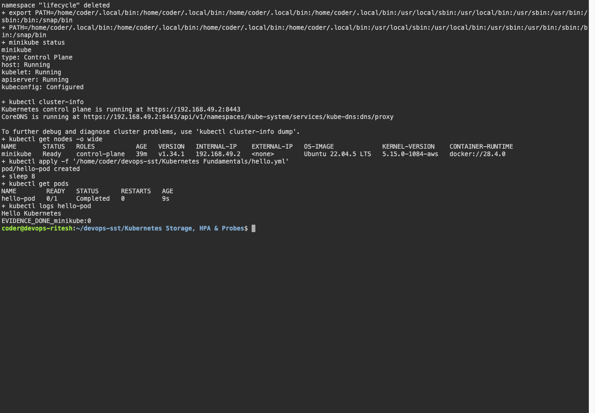

# Kubernetes Fundamentals

Created a Minikube cluster and ran a Pod that prints `Hello Kubernetes`.

```bash
minikube start --driver=docker --memory=750 --cpus=2 --force --kubernetes-version=v1.34.1
docker update --memory 1800m --memory-swap 3g minikube
minikube status
kubectl cluster-info
kubectl get nodes -o wide
kubectl apply -f hello.yml
kubectl logs hello-pod
```

Result: the node was Ready and the Pod printed `Hello Kubernetes`.

| Component | Purpose |
|---|---|
| API server | Handles cluster requests |
| etcd | Stores cluster state |
| Scheduler | Assigns Pods to nodes |
| Controllers | Maintain desired state |
| Kubelet and container runtime | Run containers on each node |
| kube-proxy | Implements Service routing |
| CoreDNS | Resolves cluster names |

A Pod runs containers, a ReplicaSet maintains replicas and a Deployment manages updates.

## Screenshots




## Command output

- [minikube](output/logs/minikube.log)
