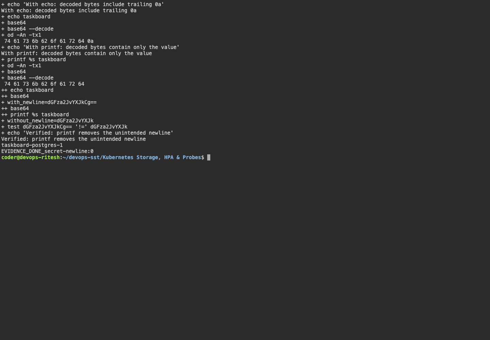

# Kubernetes Ingress, ConfigMaps & Secrets

ConfigMaps store application settings. Secrets store sensitive values; base64 encoding is not encryption. An Ingress defines HTTP routing, and an Ingress controller implements it.

## Commands

With the ingress-nginx controller installed, run from `manifests/`:

```bash
kubectl create secret generic yatri-db-secret --from-literal=POSTGRES_USER=demo --from-literal=POSTGRES_PASSWORD=demo --from-literal=POSTGRES_DB=yatri
kubectl apply -f configmap.yaml -f frontend.yaml -f backend.yaml -f ingress.yaml
kubectl rollout status deployment/yatri-frontend
kubectl rollout status deployment/yatri-backend
kubectl get configmaps,secrets,services,ingress
kubectl port-forward -n ingress-nginx service/ingress-nginx-controller 18082:80
curl -H 'Host: yatri.local' http://localhost:18082/
curl -H 'Host: yatri.local' http://localhost:18082/api/
```

Result: `/` served the frontend and `/api/` served the backend on the kind cluster. ConfigMap and Secret values were available in the application.

## Troubleshooting

Check Ingress host/path rules, controller logs, Service selectors, endpoints and target ports. Check Pod events for missing configuration keys.

`echo` adds a newline when encoding a Secret. `printf '%s'` avoids it. The decoded byte comparison confirmed the difference. See [Secret troubleshooting](troubleshooting/README.md).


## Screenshots



## Command output

- [secret localhost trust observation](output/logs/secret-localhost-trust-observation.log)
- [secret newline](output/logs/secret-newline.log)
