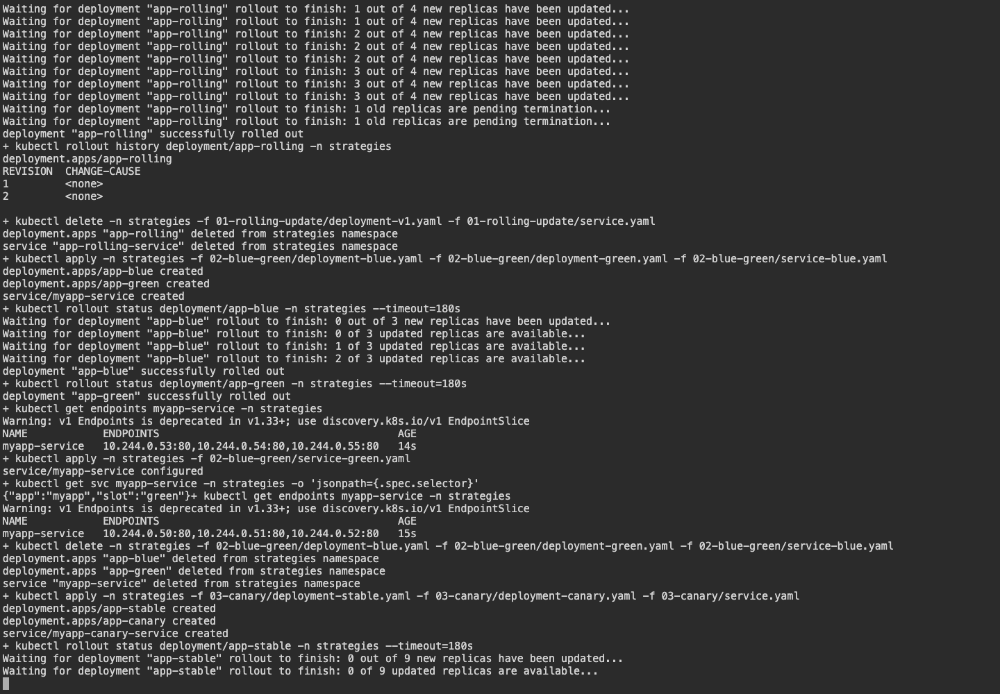
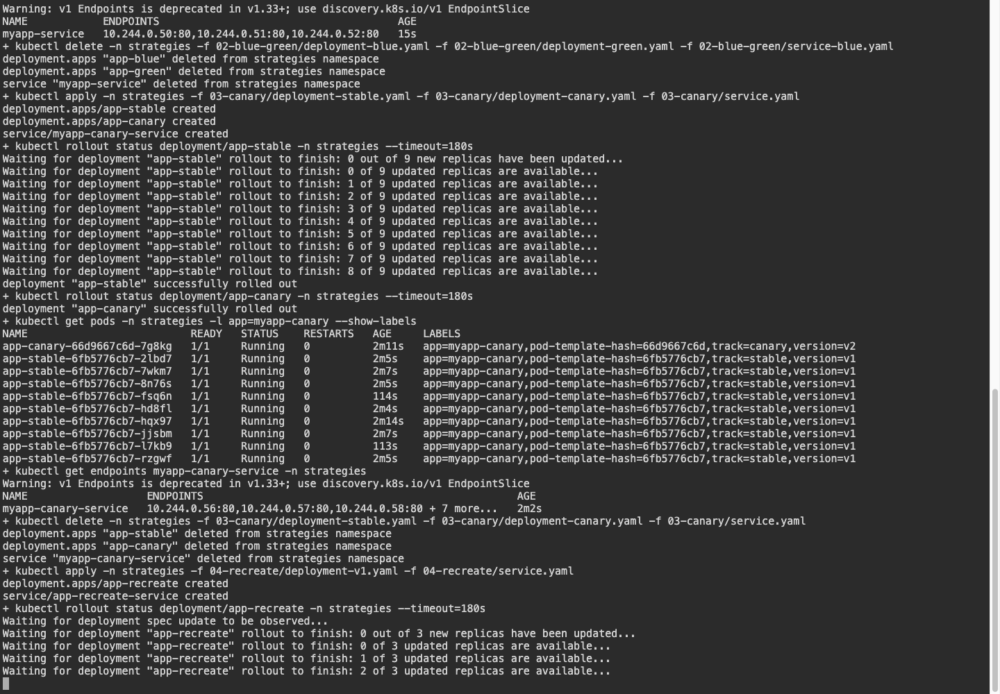
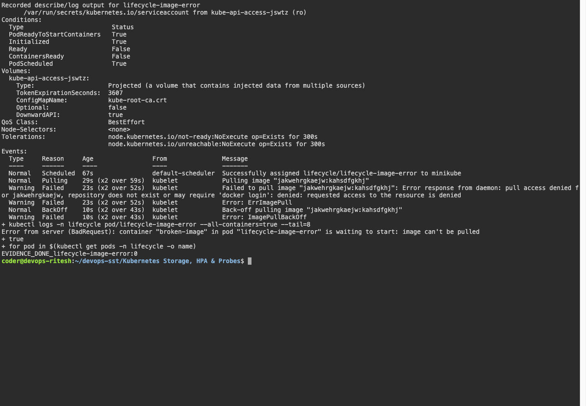
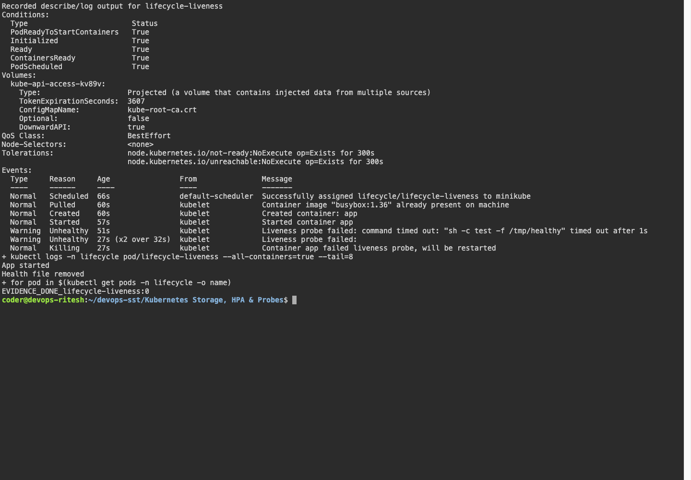
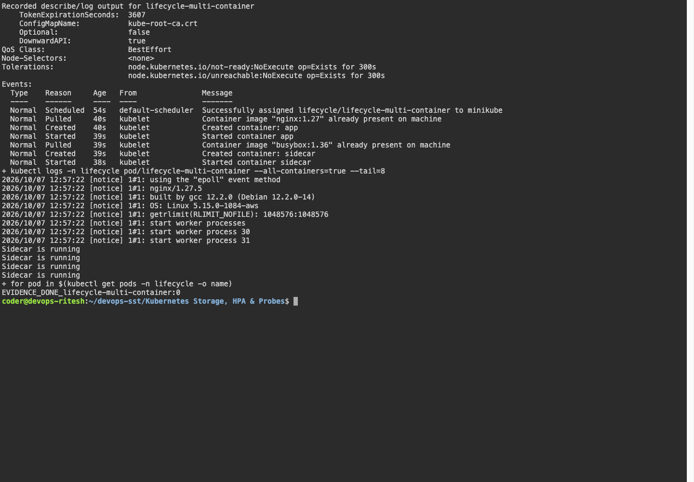
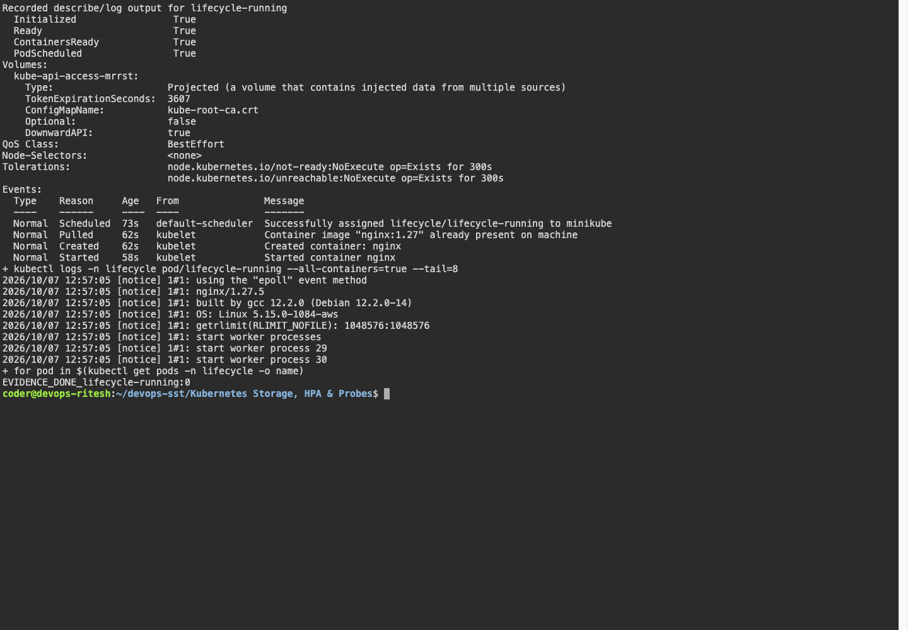
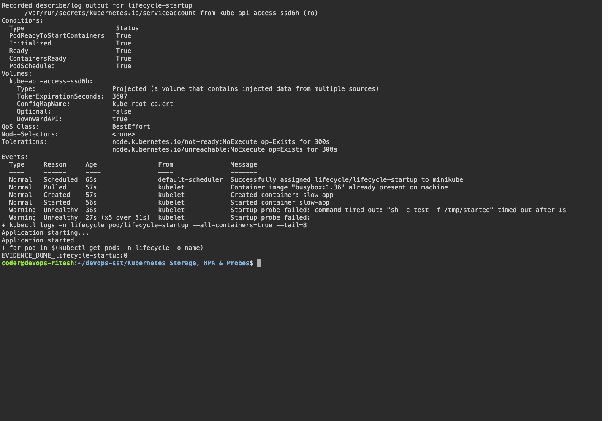
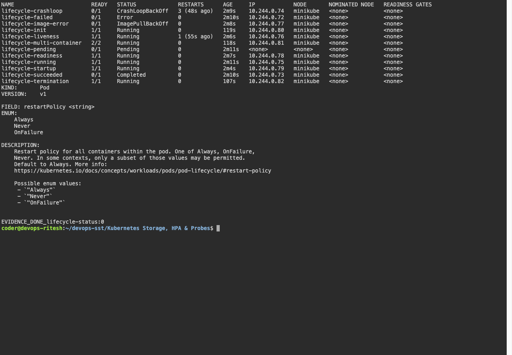
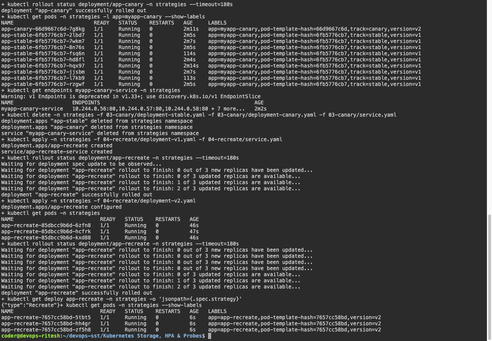
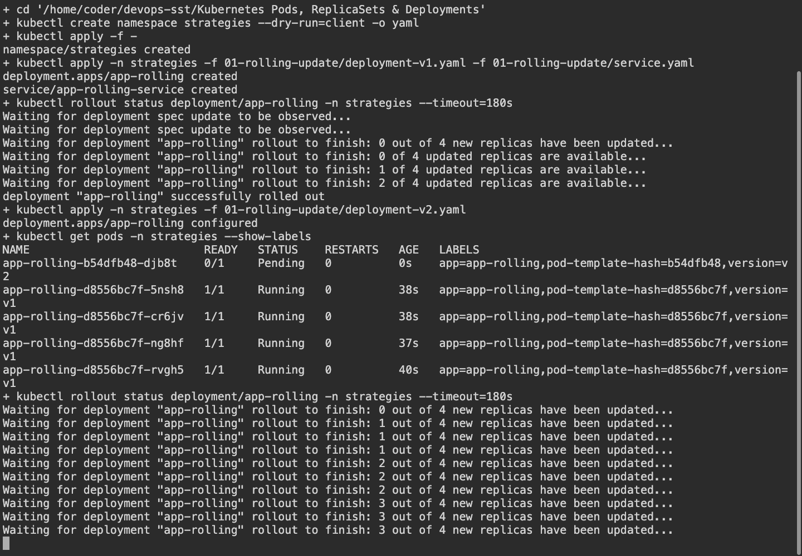

# Kubernetes Pods, ReplicaSets & Deployments

## Basic resources

```bash
kubectl apply -f manifests/
kubectl get pods,rs,deployments,services
kubectl port-forward service/nginx-service 18080:80
```

Pod, ReplicaSet, Deployment and NodePort Service manifests are in `manifests/`.

## Deployment strategies

| Strategy | Behavior |
|---|---|
| Rolling update | Replaces Pods gradually |
| Blue-green | Switches the Service selector between two versions |
| Canary | Runs nine stable Pods and one canary Pod; traffic is approximate |
| Recreate | Stops old Pods before creating replacements |

Examples are in `01-rolling-update`, `02-blue-green`, `03-canary` and `04-recreate`.

```bash
bash ../scripts/session10-strategies.sh
```

## Pod lifecycle

The 12 examples are in `pod-lifecycle/`. Check each using `kubectl get`, `describe` and `logs`.

| Example | Result |
|---|---|
| Running | Running and Ready |
| Pending | Memory request exceeds node capacity |
| Succeeded | Command exits with code 0 |
| Failed | Command exits with code 1 |
| Crash loop | CrashLoopBackOff after repeated failures |
| Image error | ImagePullBackOff for an invalid image |
| Readiness | Becomes Ready after the check passes |
| Liveness | Failed check restarts the container |
| Startup | Allows initialization before other health checks |
| Init container | Finishes before the application starts |
| Multi-container | Both containers Ready: 2/2 |
| Termination | SIGTERM handler and 20-second grace period configured |

## Screenshots

























## Command output

- [lifecycle](output/logs/lifecycle.log)
- [strategies](output/logs/strategies.log)
