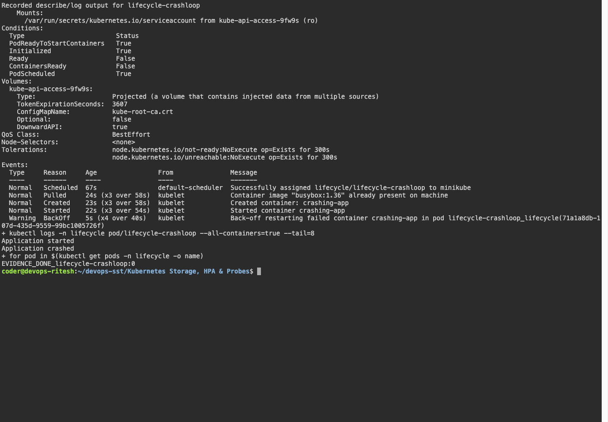
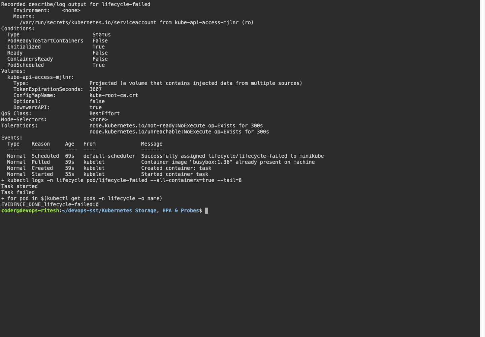
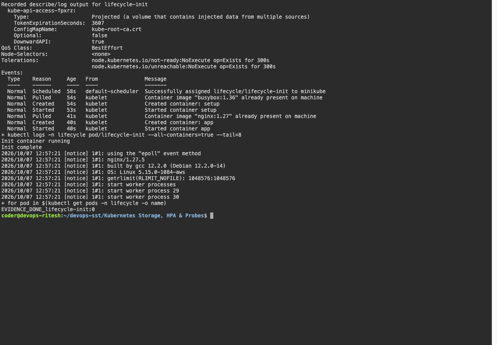
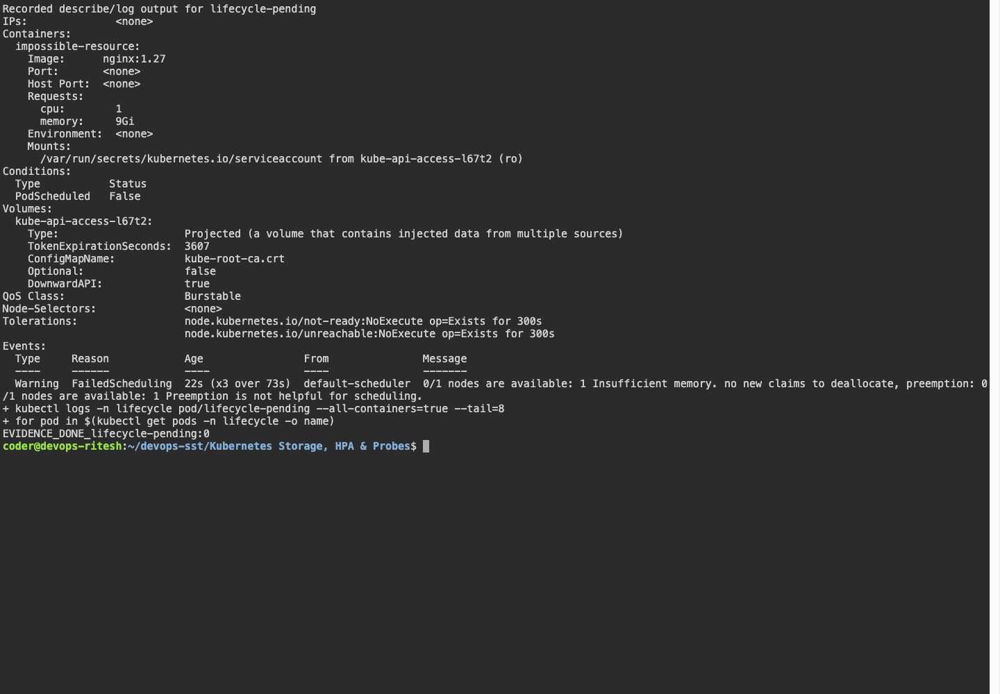
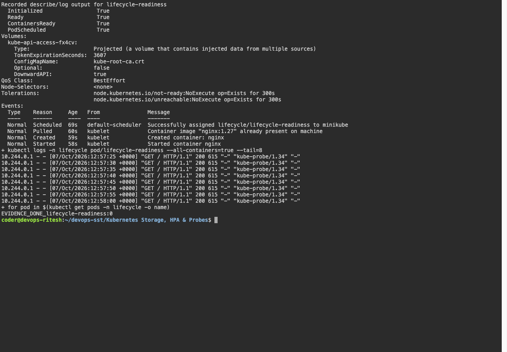
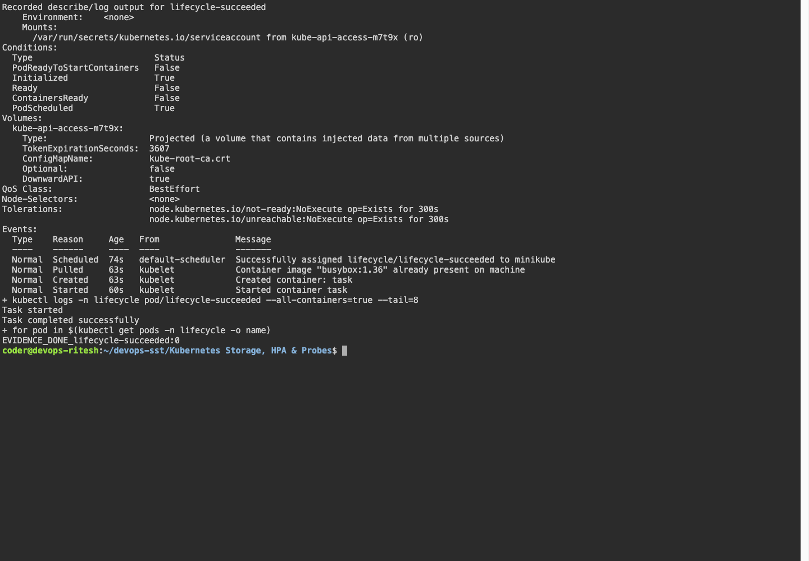
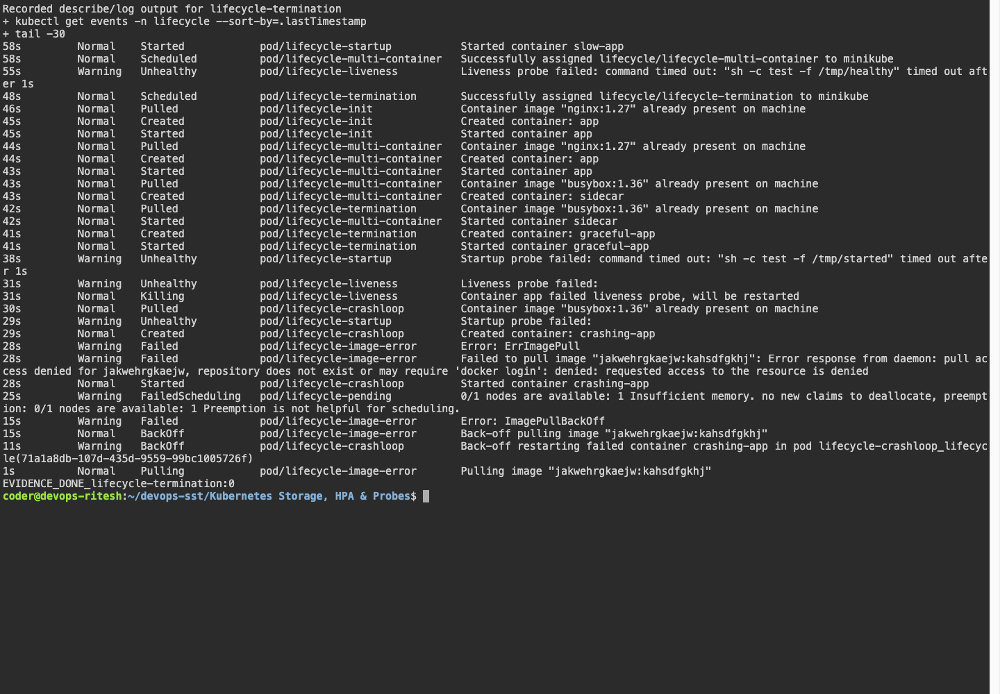
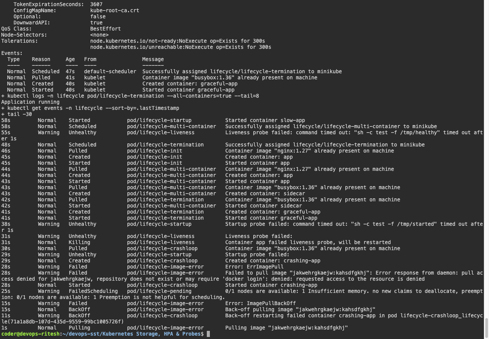

# Kubernetes Pods, ReplicaSets & Deployments

## Task

I created a Pod, ReplicaSet, Deployment, and NodePort Service using Kubernetes manifests.

## Files

```text
manifests/pod.yml
manifests/replicaset.yml
manifests/deployment.yml
manifests/service.yml
```

## Commands I ran

Run these commands from the `manifests` folder:

```bash
kubectl apply -f pod.yml -f replicaset.yml -f deployment.yml -f service.yml
kubectl wait --for=condition=Ready pod -l app=nginx --timeout=120s
kubectl get pods -l app=nginx -o wide
kubectl get rs
kubectl get deployment nginx-deployment
kubectl get svc nginx-service
kubectl port-forward service/nginx-service 18080:80 --address 127.0.0.1
```

## Output

```text
NAME                                READY   STATUS    RESTARTS   AGE   IP            NODE
nginx-deployment-6946987795-4rzjp   1/1     Running   0          6s    10.244.0.11   devops-assignment-control-plane
nginx-deployment-6946987795-7mpjf   1/1     Running   0          6s    10.244.0.9    devops-assignment-control-plane
nginx-deployment-6946987795-lqw54   1/1     Running   0          6s    10.244.0.10   devops-assignment-control-plane
nginx-pod                           1/1     Running   0          6s    10.244.0.6    devops-assignment-control-plane
nginx-rs-8msbp                      1/1     Running   0          6s    10.244.0.8    devops-assignment-control-plane
nginx-rs-clsmq                      1/1     Running   0          6s    10.244.0.7    devops-assignment-control-plane

NAME                          DESIRED   CURRENT   READY   AGE
nginx-deployment-6946987795   3         3         3       6s
nginx-rs                      3         3         3       6s

NAME               READY   UP-TO-DATE   AVAILABLE   AGE
nginx-deployment   3/3     3            3           6s

NAME            TYPE       CLUSTER-IP     EXTERNAL-IP   PORT(S)        AGE
nginx-service   NodePort   10.96.87.219   <none>        80:30080/TCP   6s
```

## Screenshot


## What I understood

A Pod runs a container. A ReplicaSet keeps replicas running. A Deployment manages updates and rollouts.

## Additional required deployment strategies

The teacher's four strategy examples are in `01-rolling-update`, `02-blue-green`, `03-canary` and `04-recreate`. Run `bash ~/devops-sst/scripts/session10-strategies.sh` to perform each workflow in the isolated `strategies` namespace.

| Strategy | What changes and what to observe |
|---|---|
| RollingUpdate | New Pods replace old Pods gradually; maxSurge=1 and maxUnavailable=0 retain availability when capacity and readiness permit. |
| Blue-green | Two complete versions run; changing the Service selector switches ready endpoint traffic between blue and green. |
| Canary | One canary Pod joins nine stable Pods behind the same Service. This approximates a 10% distribution across fresh connections; it is not an exact per-request traffic guarantee. |
| Recreate | Old Pods terminate before replacement Pods become ready, causing an availability gap. |

`pod-lifecycle/` contains the running, Pending, Succeeded, Failed, crash-loop, image-pull, readiness, liveness, startup, init-container, multi-container and termination examples. Capture `get`, `describe`, `logs` and Events for each; a Running phase alone does not imply every container is ready.

## Observed lifecycle results on the SSH cluster

| YAML example | Observation |
|---|---|
| Running | nginx reached Running and Ready. |
| Pending | 9 GiB memory request exceeds the node; no container was scheduled. |
| Succeeded | One-shot BusyBox command exited zero; status Completed. |
| Failed | One-shot command exited one; status Error. |
| Crash loop | Repeated nonzero exits produced CrashLoopBackOff. |
| Image error | Invalid image caused ImagePullBackOff. |
| Readiness | The container runs before its readiness check admits traffic; later 1/1 Ready. |
| Liveness | A failed health check restarted the container; restart count increased. |
| Startup | Startup probe gates later health checks while initialization completes. |
| Init container | Initialization completed before the application container started. |
| Multi-container | Both containers reached Running, shown as 2/2 Ready. |
| Termination | The application installs a SIGTERM handler and a 20-second grace period. |

The screenshots named `lifecycle-*` show recorded describe/log output for each YAML from the actual run. The complete transcript preserves details beyond the viewport.

## Captured evidence






















### Actual command output

- [lifecycle](output/logs/lifecycle.log)
- [strategies](output/logs/strategies.log)
