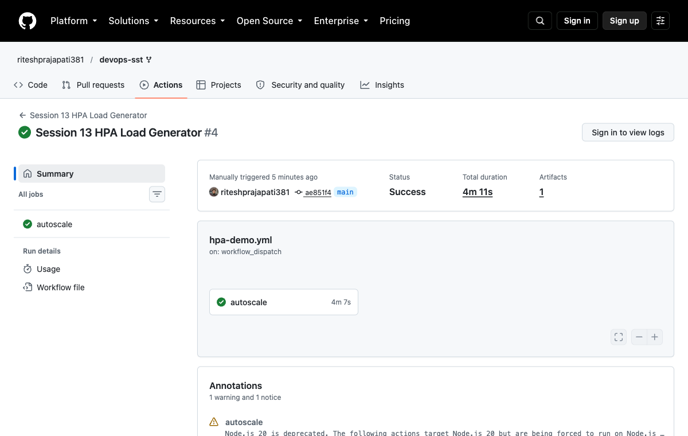

# Kubernetes Storage, HPA & Probes

## Storage

| Object | Purpose |
|---|---|
| emptyDir | Storage for the lifetime of a Pod |
| hostPath | Mounts a path from the node |
| PersistentVolume | Provides storage capacity |
| PersistentVolumeClaim | Requests storage |
| StorageClass | Defines how storage is provisioned |
| Dynamic provisioning | Creates a PV for a matching PVC |

Result: the 500 MiB PVC became Bound. Read/write checks passed for emptyDir and hostPath. The hostPath example uses `/tmp/ritesh-hostpath-data`, mounted at `/ritesh-data`.

## HPA and probes

HPA targets 50% CPU utilization and scales between 2 and 5 replicas. Startup probes allow initialization, readiness controls traffic and liveness restarts unhealthy containers.

```bash
bash ../scripts/session13.sh
bash ../scripts/session13-load.sh
kubectl get hpa,pods,pvc -n production-webapp
kubectl top pods -n production-webapp
kubectl describe hpa web-app-hpa -n production-webapp
```

Result: CPU load scaled the application from 2 to 5 replicas. The HTTP load-generator exercise also [passed in kind](https://github.com/riteshprajapati381/devops-sst/actions/runs/37628414885), with additional CPU load to trigger scaling.



## Screenshots


## Command output

- [hpa load](output/logs/hpa-load.log)
- [storage](output/logs/storage.log)
