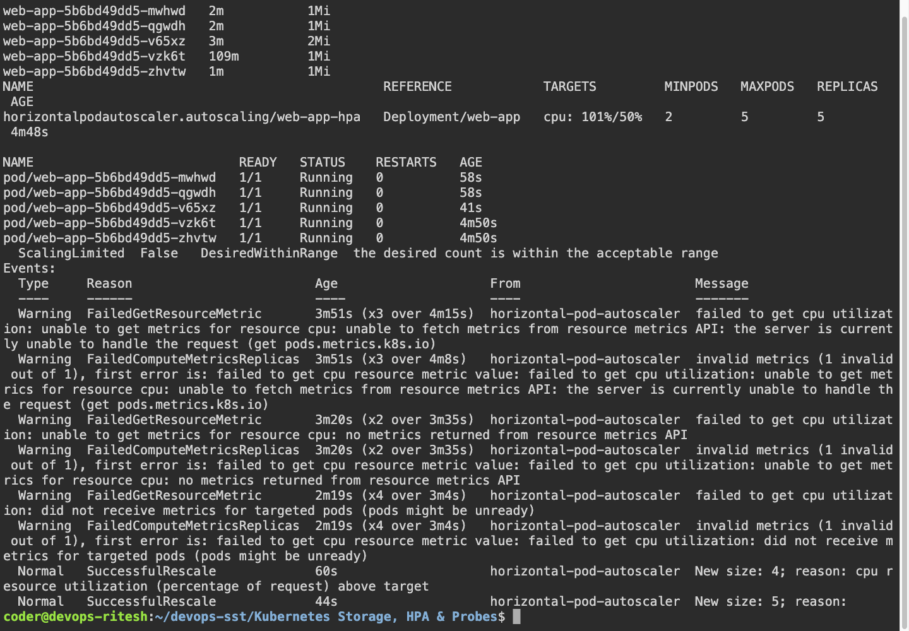
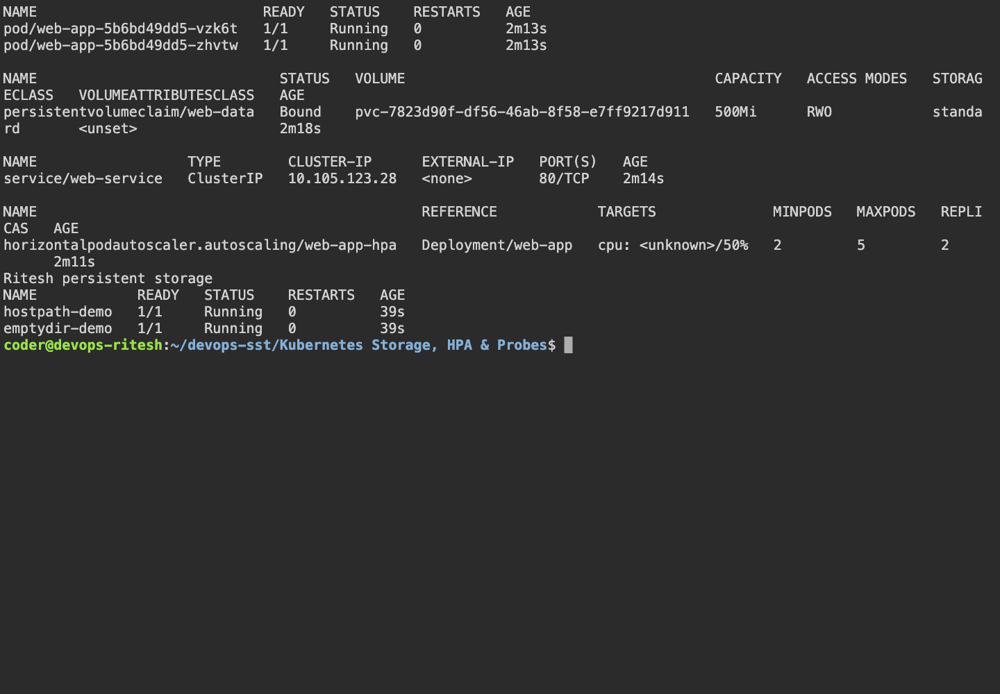

# Kubernetes Storage, HPA & Probes

## Execution environment

Name: Ritesh Prajapati. Fresh evidence was collected on 7 October 2026 from Ubuntu host `devops-ritesh`, reached using `ssh dev.devops-ritesh.riteshprajapati.coder`. Terminal images are Playwright captures of a live browser terminal connected to that SSH host. Browser images show the actual remote services through SSH port forwarding.

## Tasks and implementation

The teacher's mini-project deploys two nginx replicas, a Service, a PVC and HPA in `production-webapp`. It includes startup, readiness and liveness HTTP probes. The hostPath exercise uses `/tmp/ritesh-hostpath-data` on the node and `/ritesh-data` inside the container, changing the original classroom path as requested.

| Storage object | Scope and behavior |
|---|---|
| emptyDir | Shared volume for a Pod; survives container restarts, disappears when the Pod is removed. |
| hostPath | A path on the node; survives Pod deletion but depends on that node's filesystem. |
| PersistentVolume | Storage resource with capacity, access mode and reclaim policy. |
| PersistentVolumeClaim | A request for storage; a Pod mounts the claim after it is bound. |
| StorageClass | Defines the provisioner and policy used to dynamically provision storage. |
| Dynamic provisioning | A provisioner creates a PV in response to a suitable PVC. |

Minikube's standard StorageClass provisions the 500 MiB claim. The mini-project mounts it at `/data`. HPA compares CPU usage with requests, targets 50% utilization, and can scale from 2 to 5 replicas. `scripts/session13-load.sh` introduces a bounded CPU load in the application container and records CPU metrics and replica counts every 15 seconds. It is a deliberate resource-load test.

Startup probes protect slow starts, readiness controls Service traffic eligibility, and liveness restarts unhealthy containers. These checks serve different purposes.

## Run

```bash
bash ~/devops-sst/scripts/session13.sh
bash ~/devops-sst/scripts/session13-load.sh
kubectl get hpa,pods,pvc -n production-webapp
kubectl top pods -n production-webapp
kubectl describe hpa web-app-hpa -n production-webapp
```

## Deployed load generator

`mini-project/load-generator.yaml` runs a bounded BusyBox HTTP load generator against `web-service`. [The load-generator/HPA run passed](https://github.com/riteshprajapati381/devops-sst/actions/runs/37628414885) in kind, with the generator Ready and application replicas increasing above two. CPU pressure is introduced for 120 seconds by the existing load script; HTTP requests alone may not consume enough CPU to trigger nginx autoscaling. The initial SSH experiment separately showed scaling from two to five replicas.


[Actual kind HPA output](output/logs/hpa-github-actions.log). Metrics Server's insecure kubelet TLS option is used only for the disposable kind classroom cluster.

## Captured evidence





### Actual command output

- [hpa load](output/logs/hpa-load.log)
- [storage](output/logs/storage.log)
