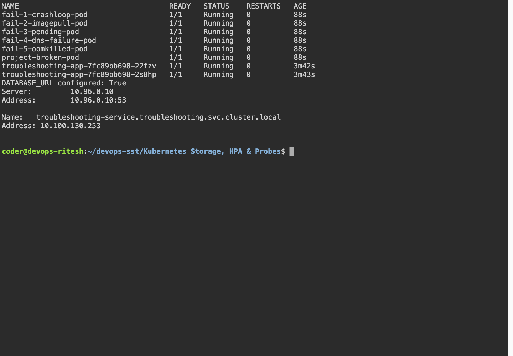
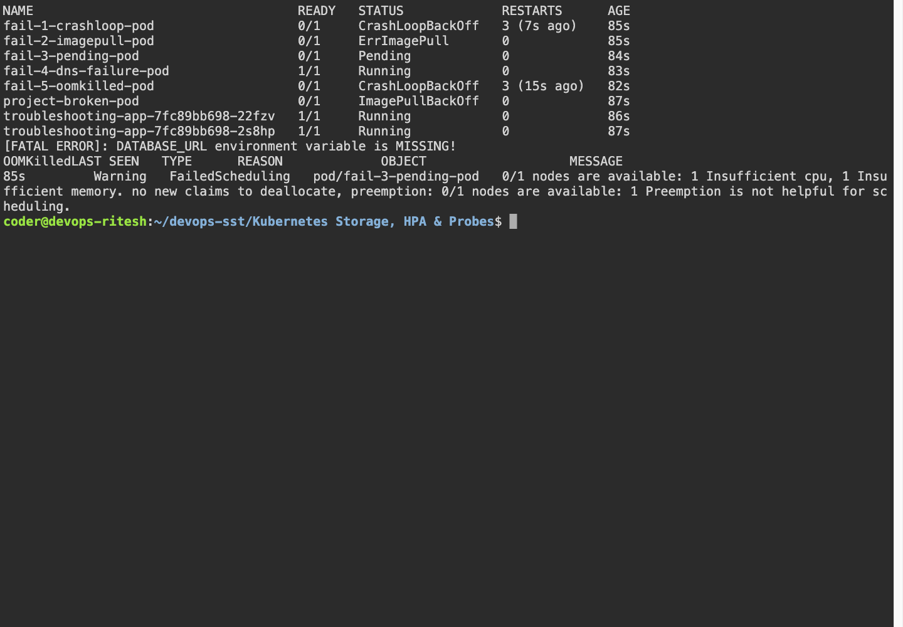

# Kubernetes Troubleshooting

## Execution environment

Name: Ritesh Prajapati. Fresh evidence was collected on 7 October 2026 from Ubuntu host `devops-ritesh`, reached using `ssh dev.devops-ritesh.riteshprajapati.coder`. Terminal images are Playwright captures of a live browser terminal connected to that SSH host. Browser images show the actual remote services through SSH port forwarding.

## Tasks and implementation

The lab includes the teacher's mini-project and five deliberately broken scenarios. `fixed/` contains the corrected manifests. They run in the `troubleshooting` namespace.

| Failure | Investigation | Root cause and correction |
|---|---|---|
| CrashLoopBackOff | `kubectl logs`, `describe`, previous termination state | Missing DATABASE_URL; add the environment value and keep the process alive. |
| ImagePullBackOff / ErrImagePull | Pod Events and image name | Invalid image/tag; replace it with an existing nginx image. |
| Pending | Scheduling Events and requests | The supplied Pod requests 500 cores and 1000 GiB; use realistic requests. |
| DNS/connectivity | `nslookup`, Service endpoints and labels | Wrong hostname or selector; correct the Service name/selector. |
| OOMKilled | Last termination reason, memory limits | Allocations exceed the 20 MiB limit; use a bounded 5 MiB allocation and a 32 MiB limit. |
| ContainerCreating | Pod Events, volume and image conditions | It is a transient state; investigate persistent image/volume/network errors rather than assuming it is always a failure. |

The Service test deliberately changes its selector to an unmatched label, shows missing endpoints, restores the selector and verifies endpoints and DNS again.

## Run

```bash
bash ~/devops-sst/scripts/session14.sh
bash ~/devops-sst/scripts/session14-fix.sh
kubectl get pods -n troubleshooting -o wide
kubectl describe pod <pod> -n troubleshooting
kubectl logs <pod> -n troubleshooting
kubectl exec <pod> -n troubleshooting -- <command>
kubectl events -n troubleshooting
kubectl explain pod.spec
kubectl top pods -n troubleshooting
```

## Captured evidence





### Actual command output

- [after](output/logs/after.log)
- [before](output/logs/before.log)
- [service fix](output/logs/service-fix.log)
