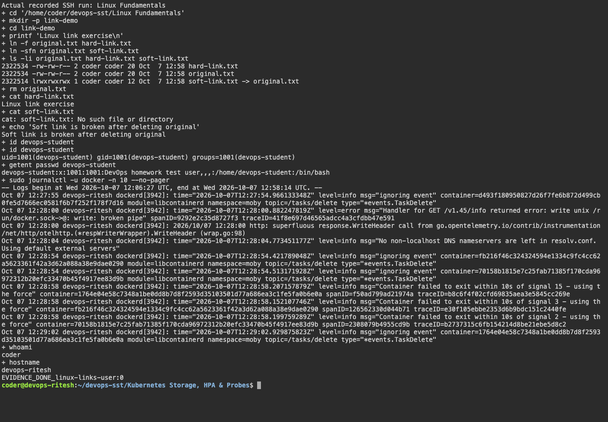
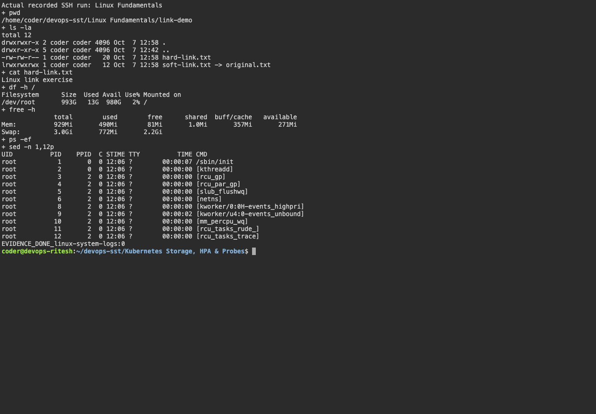

# Sessions 1–2: Linux fundamentals

Name: Ritesh Prajapati. Fresh commands ran on the Ubuntu SSH host `devops-ritesh` on 7 October 2026. Run [session02-05.sh](../scripts/session02-05.sh) to reproduce the combined Linux, shell, networking and Git exercise.

## Soft and hard links

A hard link is another directory entry for the same inode: both names refer to the same data. Removing one name leaves the other usable. Hard links cannot cross filesystems and ordinary users cannot hard-link directories. A soft link stores a target path and can cross filesystems or refer to directories. Deleting its target leaves a dangling link.

```bash
echo 'Linux link exercise' > original.txt
ln original.txt hard-link.txt
ln -s original.txt soft-link.txt
ls -li original.txt hard-link.txt soft-link.txt
rm original.txt
cat hard-link.txt
cat soft-link.txt # expected missing-target error
```

The fresh run showed matching inode numbers for the original and hard link. After deleting the original, the hard link still printed the content and the soft link failed.

## adduser and useradd

On Ubuntu, `adduser` is a convenient higher-level wrapper that sets up a home directory and asks for account details. `useradd` is a lower-level utility whose options explicitly control the home directory, shell and other settings. It is not necessary to run a separate command for each field; for example, `useradd -m -s /bin/bash name` sets both in one command.

```bash
sudo adduser --disabled-password --gecos 'DevOps homework test user' devops-student
id devops-student
getent passwd devops-student
```

The test user was created successfully. `--disabled-password` avoids creating a password for this classroom account.

## System and service logs

`journalctl` reads the systemd journal. `-u` selects a service, `-n` limits recent entries, `-b` selects the current boot, and `-f` follows new entries.

```bash
sudo journalctl -u docker -n 10 --no-pager
journalctl -b
journalctl -u docker -f
```

The recorded command reads actual Docker service startup logs.

## Command practice

| Command | Purpose |
|---|---|
| whoami / hostname / pwd | Identify the user, host and working directory. |
| ls -la / ls -li | Inspect directory entries, permissions and inode numbers. |
| cat | Read file content. |
| mkdir / touch | Create a directory or file. |
| df -h / free -h | Check filesystem capacity and memory. |
| ps -ef | Inspect running processes. |
| ln / ln -s / rm | Create links and remove names. |

## Earlier evidence retained


## Captured evidence





### Actual command output

- [session02 05](output/logs/session02-05.log)
