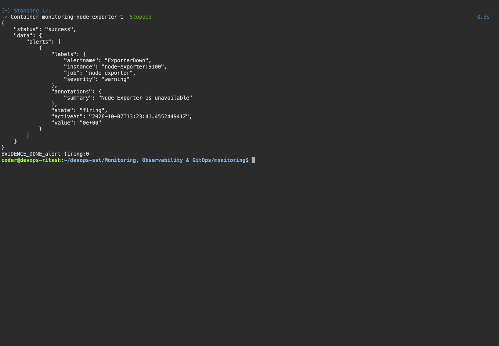
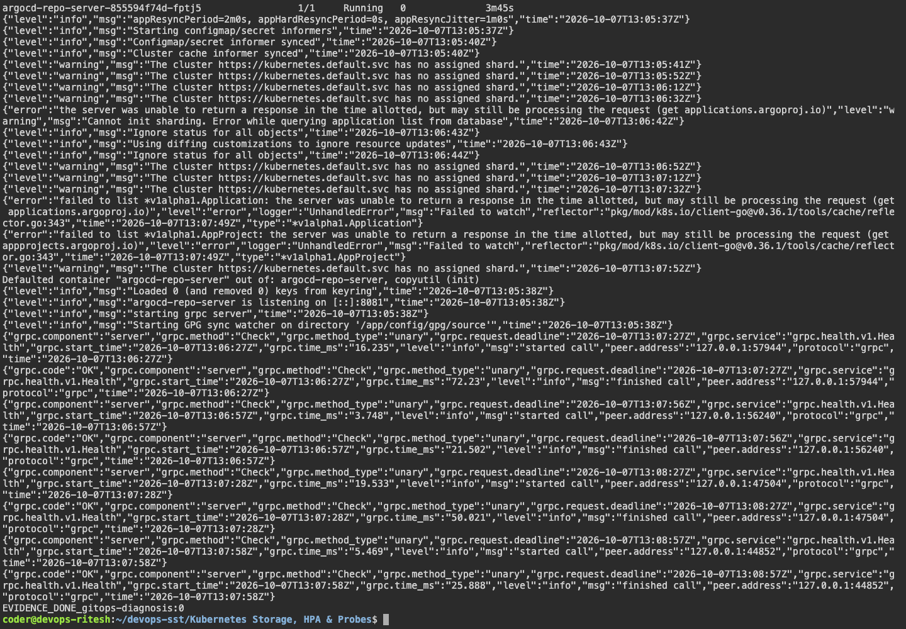
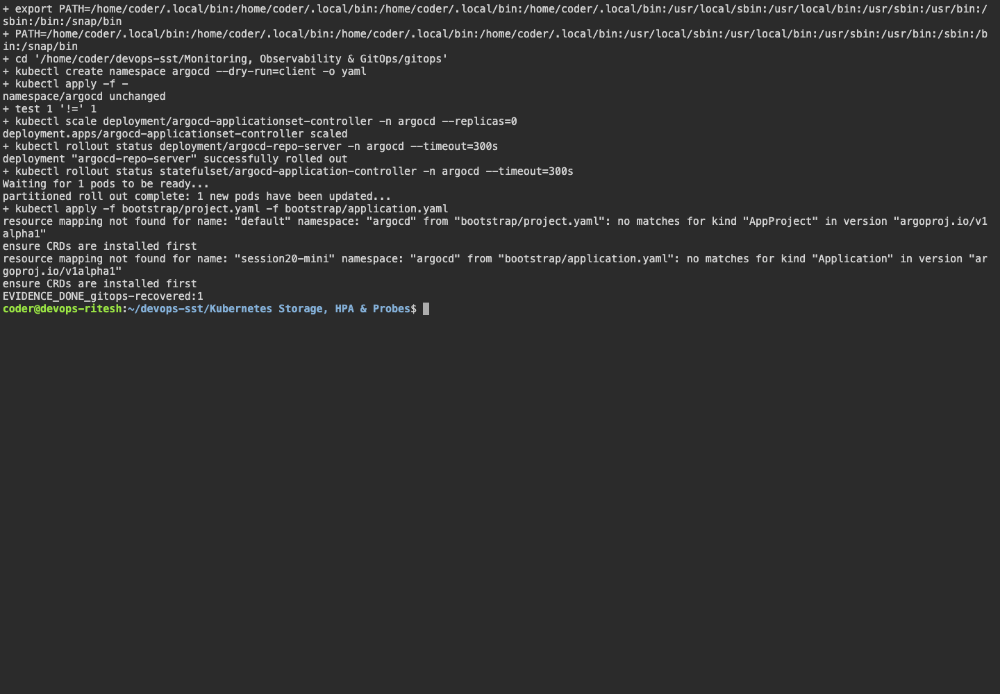
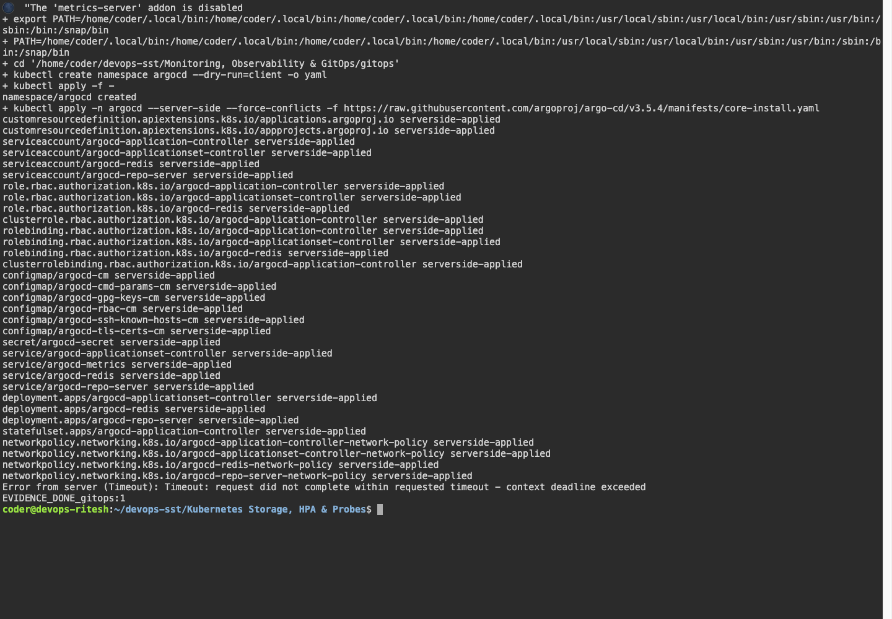
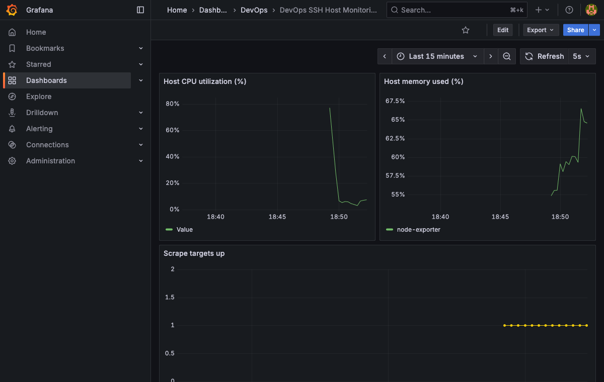
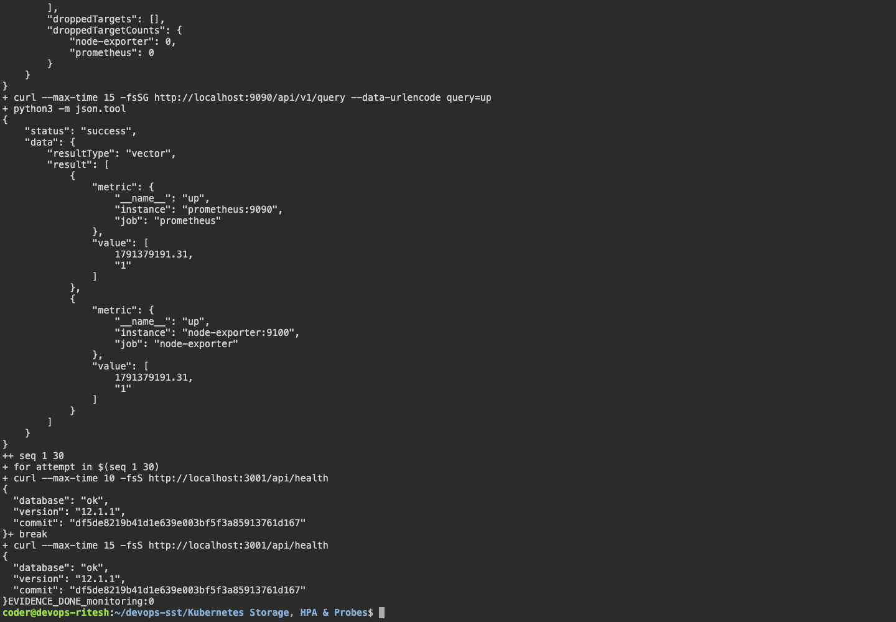

# Monitoring, Observability & GitOps

## Execution environment

Name: Ritesh Prajapati. Fresh evidence was collected on 7 October 2026 from Ubuntu host `devops-ritesh`, reached using `ssh dev.devops-ritesh.riteshprajapati.coder`. Terminal images are Playwright captures of a live browser terminal connected to that SSH host. Browser images show the actual remote services through SSH port forwarding.

## Monitoring and observability

Prometheus scrapes itself and Node Exporter every five seconds. Grafana is provisioned with the Prometheus datasource and a dashboard showing CPU utilization, memory utilization and target health. The dashboard JSON and provisioning files are committed so the setup is reproducible.

| Signal | Meaning | Typical tool |
|---|---|---|
| Metrics | Numerical measurements over time; suitable for rates, thresholds and alerts. | Prometheus/Grafana |
| Logs | Event records describing what happened. | journalctl, kubectl logs, Loki |
| Traces | A request's path and timing across services. | OpenTelemetry/Jaeger |

Observability combines these signals to investigate failures and performance. A CPU alert can identify sustained pressure; logs provide context; traces locate slow request stages.

## Run monitoring

```bash
bash ~/devops-sst/scripts/session20.sh
# SSH-forward remote 9090 and 3001 to your computer.
# Grafana classroom first login: admin / admin; set a new password.
```

Useful queries are `up`, `100 * (1 - avg(rate(node_cpu_seconds_total{mode="idle"}[1m])))`, and `100 * (1 - node_memory_MemAvailable_bytes / node_memory_MemTotal_bytes)`.

## GitOps

Git stores the desired declarative configuration. Argo CD watches the repository, compares desired state with the cluster and reconciles differences. CI validates/builds an image; a GitOps change updates the desired image tag in Git; the controller performs continuous delivery.

`gitops/app/` contains the desired workload; `gitops/bootstrap/` contains its Application and AppProject. The Application must point to the student's actual repository/path. Demonstrate synchronization, deliberately change a replica count outside Git, and show self-healing restoring the committed value.

## Verified GitOps result and SSH limitation

[The GitOps workflow passed](https://github.com/riteshprajapati381/devops-sst/actions/runs/37626346554) on a GitHub Actions kind cluster. Argo CD Core synchronized commit `53d575e`, the workload reached two Ready replicas, and an out-of-band scale to one was automatically restored to two. The final Application status was **Synced / Healthy**, and an in-cluster HTTP request returned the nginx page. The complete runner log is included below.

On the 929 MiB SSH host, Argo CD installation created its resources but the Kubernetes API timed out and the application controller could not initialize its cache reliably. The SSH attempt and diagnostic screenshot are retained; a successful Argo CD reconciliation on that host is not claimed. Minikube was stopped to free memory for the remaining Docker exercises. Monitoring runs on the SSH host separately.

Argo CD Core provides the reconciliation engine without the full UI/API deployment. The optional ApplicationSet controller is scaled to zero because this exercise manages one Application. [Official Core documentation](https://argo-cd.readthedocs.io/en/stable/operator-manual/core/).

## Monitoring result

Both Prometheus and Node Exporter targets reported UP. The actual Grafana dashboard displayed host CPU, memory and scrape target data. Stopping Node Exporter caused the `ExporterDown` rule to enter **firing**; restarting it cleared the alert. Raw alert responses and terminal/browser screenshots are included below. Docker service logs were also inspected.

Alert rules follow [Prometheus alerting rule syntax](https://prometheus.io/docs/prometheus/latest/configuration/alerting_rules/). The short ten-second delay is for the classroom demonstration. Notifications to an external recipient are not configured.

## Captured evidence
















### Actual command output

- [alert firing](output/logs/alert-firing.log)
- [alert recovered](output/logs/alert-recovered.log)
- [gitops github actions](output/logs/gitops-github-actions.log)
- [gitops recovered](output/logs/gitops-recovered.log)
- [gitops](output/logs/gitops.log)
- [monitoring first attempt](output/logs/monitoring-first-attempt.log)
- [monitoring](output/logs/monitoring.log)
