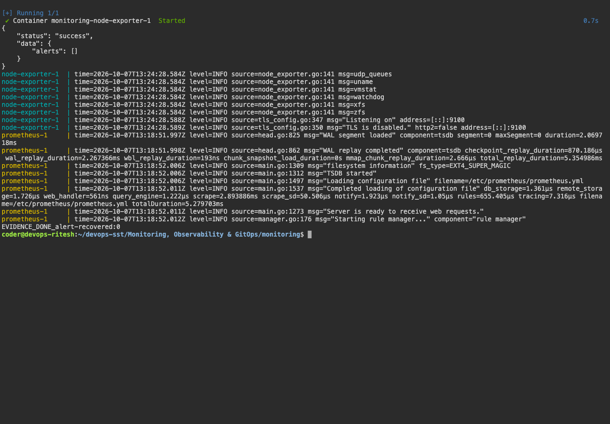
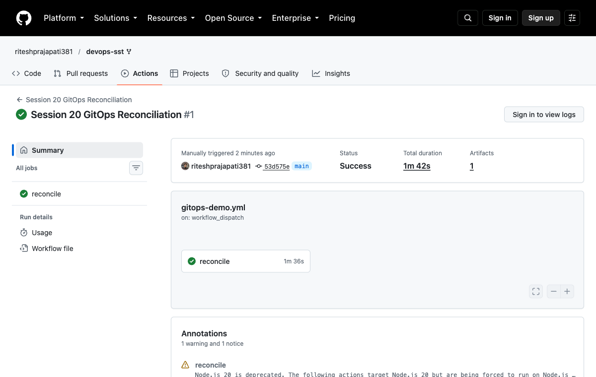
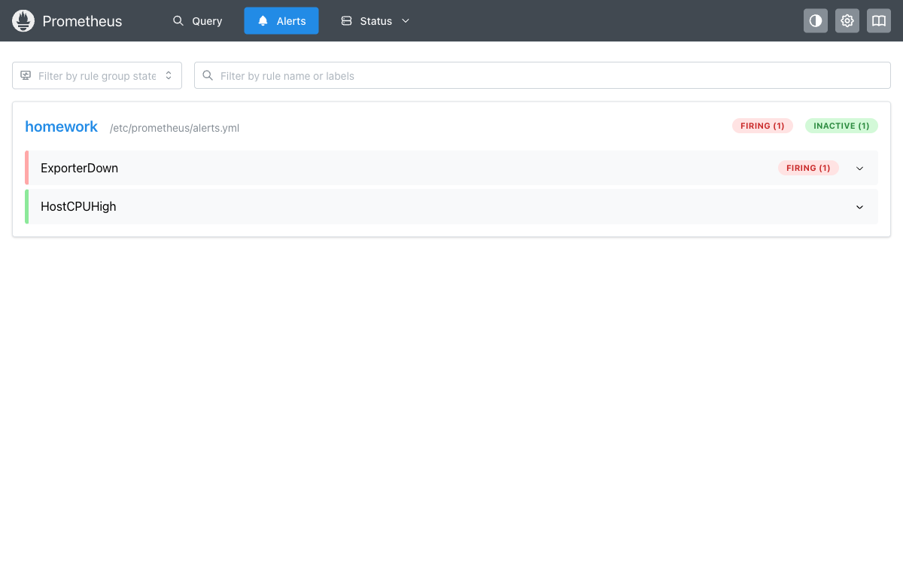
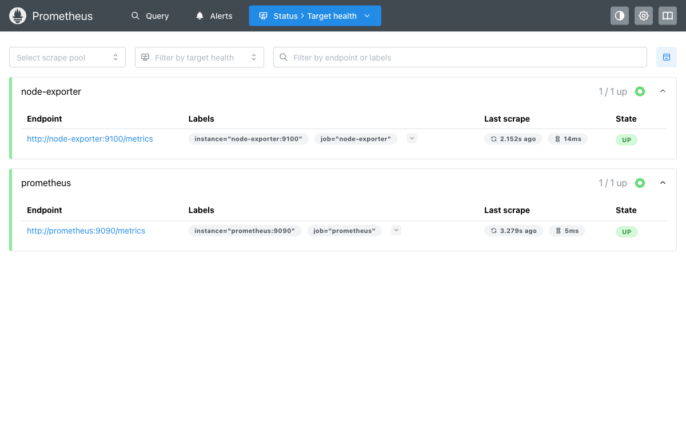

# Monitoring, Observability & GitOps

## Monitoring

Prometheus collects metrics from Node Exporter. Grafana displays CPU, memory and target health.

| Signal | Purpose | Tool |
|---|---|---|
| Metrics | Numerical measurements and alerts | Prometheus, Grafana |
| Logs | Records of events and errors | journalctl, kubectl logs |
| Traces | Request paths and timings across services | OpenTelemetry, Jaeger |

```bash
bash ../scripts/session20.sh
```

Queries: `up`, `100 * (1 - avg(rate(node_cpu_seconds_total{mode="idle"}[1m])))` and `100 * (1 - node_memory_MemAvailable_bytes / node_memory_MemTotal_bytes)`.

Result: both targets were UP. Stopping Node Exporter triggered `ExporterDown`; restarting it cleared the alert.

## GitOps

Git holds the desired configuration and Argo CD synchronizes the cluster. Application manifests are in `gitops/app/` and bootstrap manifests in `gitops/bootstrap/`.

Result: Argo CD reached Synced / Healthy with two Ready replicas in the [kind workflow](https://github.com/riteshprajapati381/devops-sst/actions/runs/37626346554). Scaling to one replica was automatically corrected back to two, and an HTTP check passed. The SSH installation attempt timed out.

## Screenshots











## Command output

- [alert firing](output/logs/alert-firing.log)
- [alert recovered](output/logs/alert-recovered.log)
- [gitops github actions](output/logs/gitops-github-actions.log)
- [SSH Argo CD retry](output/logs/gitops-recovered.log)
- [gitops](output/logs/gitops.log)
- [monitoring first attempt](output/logs/monitoring-first-attempt.log)
- [monitoring](output/logs/monitoring.log)
