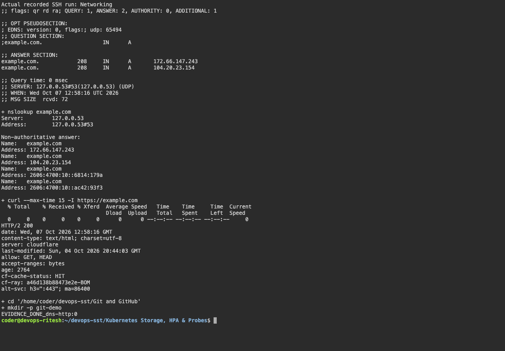
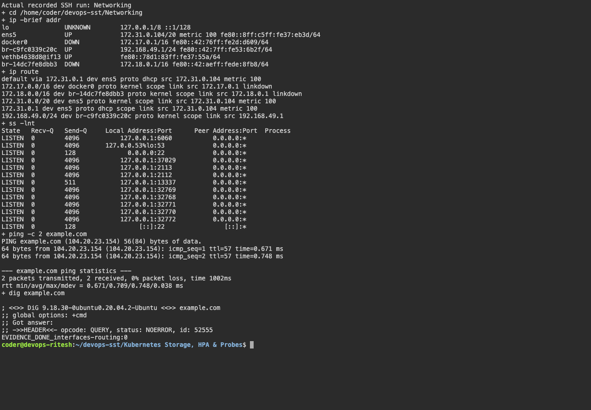

## ping 
used for checking if intenrt is working by sending and recieving packages to a external website.
OR to check if a external service or a domain name is active or down. 
```bash
coder@ritesh-aws:~/devops-assignment$ ping scaler.com
PING scaler.com (18.172.78.88) 56(84) bytes of data.
64 bytes from server-18-172-78-88.bom78.r.cloudfront.net (18.172.78.88): icmp_seq=1 ttl=250 time=0.500 ms
64 bytes from server-18-172-78-88.bom78.r.cloudfront.net (18.172.78.88): icmp_seq=2 ttl=250 time=0.304 ms
^C
--- scaler.com ping statistics ---
2 packets transmitted, 2 received, 0% packet loss, time 1002ms
rtt min/avg/max/mdev = 0.304/0.402/0.500/0.098 ms
```

## tracerouter
used to trace the router of a packet from our computer to the server.

```bash
coder@ritesh-aws:~/devops-assignment$ traceroute scaler.com
traceroute to scaler.com (18.172.78.67), 30 hops max, 60 byte packets
 1  244.5.0.129 (244.5.0.129)  5.275 ms 244.5.0.133 (244.5.0.133)  3.988 ms 244.5.0.145 (244.5.0.145)  8.665 ms
 2  240.3.240.9 (240.3.240.9)  0.248 ms 240.7.96.7 (240.7.96.7)  0.245 ms 240.7.96.5 (240.7.96.5)  0.308 ms
 3  240.2.64.44 (240.2.64.44)  0.945 ms 100.66.8.214 (100.66.8.214)  7.896 ms 240.2.64.44 (240.2.64.44)  1.387 ms
 4  100.66.11.0 (100.66.11.0)  0.885 ms 240.2.64.55 (240.2.64.55)  0.496 ms 100.66.11.228 (100.66.11.228)  6.594 ms
 5  240.2.64.23 (240.2.64.23)  0.465 ms 240.4.200.4 (240.4.200.4)  0.300 ms 240.4.200.7 (240.4.200.7)  0.240 ms
 6  240.64.120.208 (240.64.120.208)  0.401 ms 240.64.120.209 (240.64.120.209)  0.384 ms 240.64.120.208 (240.64.120.208)  0.370 ms
 7  * * 240.2.64.52 (240.2.64.52)  0.406 ms
 8  240.2.64.18 (240.2.64.18)  0.388 ms * 240.2.64.30 (240.2.64.30)  0.392 ms
 ```

## curl
used to test http or do http/https requests used to test apis, send requests over the web. 

```bash
coder@ritesh-aws:~/devops-assignment$ sudo tcpdump -i eth0 host google.com
tcpdump: eth0: No such device exists
(SIOCGIFHWADDR: No such device)
coder@ritesh-aws:~/devops-assignment$ curl -I https://www.google.com
HTTP/2 200 
content-type: text/html; charset=ISO-8859-1
content-security-policy-report-only: object-src 'none';base-uri 'self';script-src 'nonce-NN7oPYRuld7G9bt82wKVdg' 'strict-dynamic' 'report-sample' 'unsafe-eval' 'unsafe-inline' https: http:;report-uri https://csp.withgoogle.com/csp/gws/other-hp
accept-ch: Sec-CH-Prefers-Color-Scheme
p3p: CP="This is not a P3P policy! See g.co/p3phelp for more info."
date: Wed, 02 Sep 2026 20:06:01 GMT
server: gws
x-xss-protection: 0
x-frame-options: SAMEORIGIN
expires: Wed, 02 Sep 2026 20:06:01 GMT
cache-control: private
set-cookie: __Secure-STRP=ANmZwa3lXEZAretJb8wphpK7jsnOZuvP7WBrFwKuR8zIfUbNvtIw8OzraDEk5xMUJQJhtJ3k2_9gSG9P_osm0eU1KuL7APiDjVlG; expires=Wed, 02-Sep-2026 20:11:01 GMT; path=/; domain=.google.com; Secure; SameSite=strict
set-cookie: AEC=AdJVEata104NVe44S6bqjFIf56OK_D2R8XU1O8wPD4RLixm0U9OpxbqsuQ; expires=Mon, 01-Mar-2027 20:06:01 GMT; path=/; domain=.google.com; Secure; HttpOnly; SameSite=lax
set-cookie: NID=534=gZFH1o_tubiwB7uUdidorv19mY6Xvrj5NAtC-kmxPDFBu2E-MLlfz8-BlPrqPBP2qwEHaySbgzakIkKQhMeXd-hq2PB7BXJSOcDq7gA2ZLd-m8seT4upyc1nsJqStxSRpIMYeHn27gFcKRYOTY2hfBVPVBls7Gda5MQkY6zfbLLh5reHX73JN2e6Sabg6dD-kvLTYFzJrIG8Mu6z4ZQ; expires=Thu, 04-Mar-2027 20:06:01 GMT; path=/; domain=.google.com; HttpOnly
alt-svc: h3=":443"; ma=2592000,h3-29=":443"; ma=2592000

```


## Fresh SSH command explanations

| Command | What it shows |
|---|---|
| ip -brief addr | Interface addresses and status. |
| ip route | Routing table and default gateway. |
| ss -lnt | Listening TCP ports. |
| ping -c 2 example.com | ICMP reachability and round-trip time; blocked ICMP does not imply HTTP failure. |
| dig / nslookup example.com | DNS resolution and returned records. |
| curl -I https://example.com | HTTP response headers; the fresh run returned HTTP/2 200. |

The raw combined run and fresh terminal screenshots are linked below. Earlier examples above ran on the previous host.

## Captured evidence





### Actual command output

- [session02 05](output/logs/session02-05.log)
