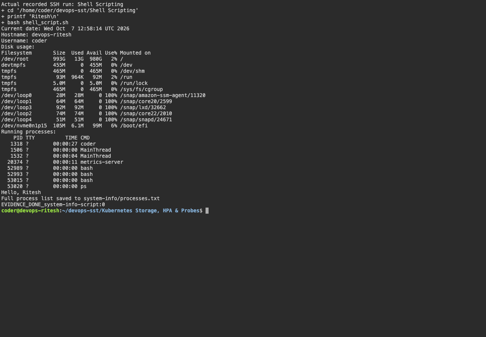

# Shell Scripting

The [script](shell_script.sh) prints the date, hostname, username, disk usage and processes. It reads a name, creates `system-info/` and saves the process list to `system-info/processes.txt`.

```bash
chmod +x shell_script.sh
./shell_script.sh
cat system-info/processes.txt
```

Result: system details displayed and the process list saved successfully.

## Screenshots



## Command output

- [session02 05](output/logs/session02-05.log)
