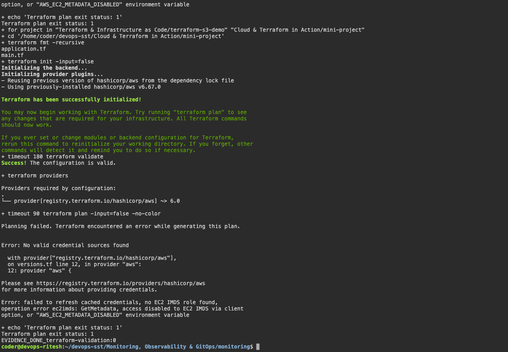

# Terraform & Infrastructure as Code

## S3 project

`terraform-s3-demo/` defines an S3 bucket, AWS provider, variables and outputs. The region is `ap-south-1`.

```bash
cd terraform-s3-demo
terraform fmt -recursive
terraform init
terraform validate
terraform plan
```

Result: formatting, initialization and validation passed. Plan failed because AWS credentials were unavailable. No AWS resources were created.

After configuring AWS credentials:

```bash
terraform apply
terraform show
terraform output
terraform destroy
```

Apply, resource verification and destroy remain pending.

## AWS service research

[IAM](aws-services/01-iam/README.md) · [EC2](aws-services/02-ec2/README.md) · [S3](aws-services/03-s3/README.md) · [VPC](aws-services/04-vpc/README.md) · [DynamoDB and RDS](aws-services/05-dynamodb-rds/README.md)

## Screenshots




## Command output

- [terraform validation](output/logs/terraform-validation.log)
- [terraform](output/logs/terraform.log)
